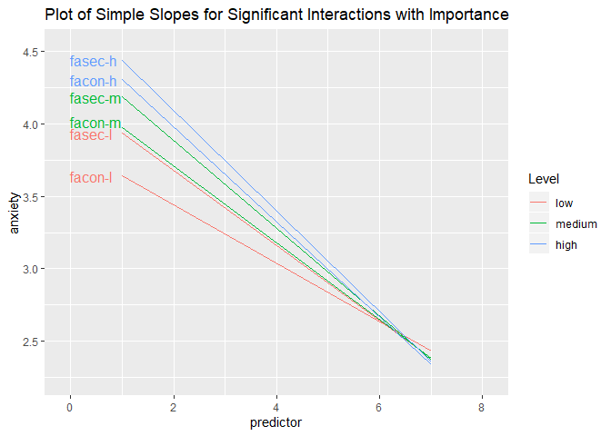

HW \#3: Interaction Effects and Multi-Group Analyses
================
Daniel Lewis
December 25, 2019

# Set up working environment

Load packages

``` r
# Tidyverse #
library(tidyverse)
library(readxl)
library(broom)
library(corrr)
library(magrittr)
library(wrapr)
library(viridis)
library(directlabels)

# Markdown #
library(rmarkdown)
library(tinytex)
library(knitr)
library(printr)
library(kableExtra)

# Other #
library(psych)
library(here)
```

# Coding for Multi-Group Analyses

Import data and change variable names.

``` r
tbl.2 <- read_xlsx(here("data", "BEER.xlsx"))
colnames(tbl.2) <- c("bubb", 'beer', 'salt')
```

View data table

``` r
ks <- function(t, c) {
  kable(t, caption = c, format = 'html', escape = F, digits = 3) %>%
  kable_styling(full_width = F, position = 'left', fixed_thead = T)
  }

ks(tbl.2[1:10,], 'Beer Data (first 10 observations)')
```

<table class="table" style="width: auto !important; ">

<caption>

Beer Data (first 10 observations)

</caption>

<thead>

<tr>

<th style="text-align:right;position: sticky; top:0; background-color: #FFFFFF;">

bubb

</th>

<th style="text-align:left;position: sticky; top:0; background-color: #FFFFFF;">

beer

</th>

<th style="text-align:left;position: sticky; top:0; background-color: #FFFFFF;">

salt

</th>

</tr>

</thead>

<tbody>

<tr>

<td style="text-align:right;">

12

</td>

<td style="text-align:left;">

guinness

</td>

<td style="text-align:left;">

no

</td>

</tr>

<tr>

<td style="text-align:right;">

21

</td>

<td style="text-align:left;">

guinness

</td>

<td style="text-align:left;">

no

</td>

</tr>

<tr>

<td style="text-align:right;">

5

</td>

<td style="text-align:left;">

guinness

</td>

<td style="text-align:left;">

no

</td>

</tr>

<tr>

<td style="text-align:right;">

10

</td>

<td style="text-align:left;">

guinness

</td>

<td style="text-align:left;">

no

</td>

</tr>

<tr>

<td style="text-align:right;">

20

</td>

<td style="text-align:left;">

guinness

</td>

<td style="text-align:left;">

no

</td>

</tr>

<tr>

<td style="text-align:right;">

13

</td>

<td style="text-align:left;">

guinness

</td>

<td style="text-align:left;">

no

</td>

</tr>

<tr>

<td style="text-align:right;">

24

</td>

<td style="text-align:left;">

heineken

</td>

<td style="text-align:left;">

no

</td>

</tr>

<tr>

<td style="text-align:right;">

17

</td>

<td style="text-align:left;">

heineken

</td>

<td style="text-align:left;">

no

</td>

</tr>

<tr>

<td style="text-align:right;">

26

</td>

<td style="text-align:left;">

heineken

</td>

<td style="text-align:left;">

no

</td>

</tr>

<tr>

<td style="text-align:right;">

16

</td>

<td style="text-align:left;">

heineken

</td>

<td style="text-align:left;">

no

</td>

</tr>

</tbody>

</table>

## Dummy Coding

Dummy code variables

``` r
tbl.2 <- tbl.2 %>%
  mutate(beer.f = factor(beer),
         salt.f = factor(salt))

# rename columns for each single-column matrix in 'a' with its name in a
reCol <- function(a) {
  n <- names(a)
  for (i in 1:length(a)) {
    colnames(a[[i]]) <- c(str_sub(n[i], end = 4L))
  }
  a
}

tbl.2 %>%
  select_if(is.factor) %>%
  map(contrasts) %>%
  reCol() %>%
  ks("Dummy Codes")
```

<table class="kable_wrapper table" style="width: auto !important; ">

<caption>

Dummy Codes

</caption>

<tbody>

<tr>

<td>

<table>

<thead>

<tr>

<th style="text-align:left;position: sticky; top:0; background-color: #FFFFFF;">

</th>

<th style="text-align:right;position: sticky; top:0; background-color: #FFFFFF;">

beer

</th>

</tr>

</thead>

<tbody>

<tr>

<td style="text-align:left;">

guinness

</td>

<td style="text-align:right;">

0

</td>

</tr>

<tr>

<td style="text-align:left;">

heineken

</td>

<td style="text-align:right;">

1

</td>

</tr>

</tbody>

</table>

</td>

<td>

<table>

<thead>

<tr>

<th style="text-align:left;position: sticky; top:0; background-color: #FFFFFF;">

</th>

<th style="text-align:right;position: sticky; top:0; background-color: #FFFFFF;">

salt

</th>

</tr>

</thead>

<tbody>

<tr>

<td style="text-align:left;">

no

</td>

<td style="text-align:right;">

0

</td>

</tr>

<tr>

<td style="text-align:left;">

yes

</td>

<td style="text-align:right;">

1

</td>

</tr>

</tbody>

</table>

</td>

</tr>

</tbody>

</table>

Analyze dummy-coded data

``` r
fit.2.a <- lm(bubb ~ beer.f + salt.f +
                beer.f * salt.f, tbl.2)

fit.2.a %>%
  tidy() %>%
  ks('Regression: Interaction of Beer and Salt')
```

<table class="table" style="width: auto !important; ">

<caption>

Regression: Interaction of Beer and Salt

</caption>

<thead>

<tr>

<th style="text-align:left;position: sticky; top:0; background-color: #FFFFFF;">

term

</th>

<th style="text-align:right;position: sticky; top:0; background-color: #FFFFFF;">

estimate

</th>

<th style="text-align:right;position: sticky; top:0; background-color: #FFFFFF;">

std.error

</th>

<th style="text-align:right;position: sticky; top:0; background-color: #FFFFFF;">

statistic

</th>

<th style="text-align:right;position: sticky; top:0; background-color: #FFFFFF;">

p.value

</th>

</tr>

</thead>

<tbody>

<tr>

<td style="text-align:left;">

(Intercept)

</td>

<td style="text-align:right;">

13.500

</td>

<td style="text-align:right;">

2.332

</td>

<td style="text-align:right;">

5.789

</td>

<td style="text-align:right;">

0.000

</td>

</tr>

<tr>

<td style="text-align:left;">

beer.fheineken

</td>

<td style="text-align:right;">

9.667

</td>

<td style="text-align:right;">

3.298

</td>

<td style="text-align:right;">

2.931

</td>

<td style="text-align:right;">

0.008

</td>

</tr>

<tr>

<td style="text-align:left;">

salt.fyes

</td>

<td style="text-align:right;">

7.167

</td>

<td style="text-align:right;">

3.298

</td>

<td style="text-align:right;">

2.173

</td>

<td style="text-align:right;">

0.042

</td>

</tr>

<tr>

<td style="text-align:left;">

beer.fheineken:salt.fyes

</td>

<td style="text-align:right;">

16.833

</td>

<td style="text-align:right;">

4.664

</td>

<td style="text-align:right;">

3.609

</td>

<td style="text-align:right;">

0.002

</td>

</tr>

</tbody>

</table>

``` r
tbl.2.e <- tibble(beer.f = factor(c("guinness", "guinness",
                                    "heineken", "heineken")),
                  salt.f = factor(c("no", 'yes', 'no', 'yes')))

tbl.2.b <- predict(fit.2.a, newdata = tbl.2.e) %>%
  set_names(c("irish", "irish & salty",
              "dutch", "dutch & salty")) %>%
  enframe(name = "combo", value = 'bubbles')

tbl.2.b %>%
  ks('Predicted Number of Bubbles')
```

<table class="table" style="width: auto !important; ">

<caption>

Predicted Number of Bubbles

</caption>

<thead>

<tr>

<th style="text-align:left;position: sticky; top:0; background-color: #FFFFFF;">

combo

</th>

<th style="text-align:right;position: sticky; top:0; background-color: #FFFFFF;">

bubbles

</th>

</tr>

</thead>

<tbody>

<tr>

<td style="text-align:left;">

irish

</td>

<td style="text-align:right;">

13.500

</td>

</tr>

<tr>

<td style="text-align:left;">

irish & salty

</td>

<td style="text-align:right;">

20.667

</td>

</tr>

<tr>

<td style="text-align:left;">

dutch

</td>

<td style="text-align:right;">

23.167

</td>

</tr>

<tr>

<td style="text-align:left;">

dutch & salty

</td>

<td style="text-align:right;">

47.167

</td>

</tr>

</tbody>

</table>

``` r
1:2 %>%
  map_dbl(~ tbl.2.b$bubbles[.*2] / tbl.2.b$bubbles[.]) %>%
  set_names(c('guinness','heineken')) %>%
  enframe("beer", "salt multiplier") %>%
  ks('Effect of Salt by Beer')
```

<table class="table" style="width: auto !important; ">

<caption>

Effect of Salt by Beer

</caption>

<thead>

<tr>

<th style="text-align:left;position: sticky; top:0; background-color: #FFFFFF;">

beer

</th>

<th style="text-align:right;position: sticky; top:0; background-color: #FFFFFF;">

salt multiplier

</th>

</tr>

</thead>

<tbody>

<tr>

<td style="text-align:left;">

guinness

</td>

<td style="text-align:right;">

1.531

</td>

</tr>

<tr>

<td style="text-align:left;">

heineken

</td>

<td style="text-align:right;">

2.282

</td>

</tr>

</tbody>

</table>

## Contrast Coding

Contrast code variables

``` r
tbl.2 <- tbl.2 %>%
  mutate_if(~ is.factor(.) && contrasts(.)[1] != -.5, list(c = ~ C(., (contr.sum(2)/(-2))))) %>%
  rename_at(vars(contains('_c')),
            list(~ paste(gsub('.f_c', '', .), 'c', sep = '.')))

tbl.2 %>%
  select_at(vars(ends_with('.c'))) %>%
  map(contrasts) %>%
  reCol %>%
  ks('Contrast Code')
```

<table class="kable_wrapper table" style="width: auto !important; ">

<caption>

Contrast Code

</caption>

<tbody>

<tr>

<td>

<table>

<thead>

<tr>

<th style="text-align:left;position: sticky; top:0; background-color: #FFFFFF;">

</th>

<th style="text-align:right;position: sticky; top:0; background-color: #FFFFFF;">

beer

</th>

</tr>

</thead>

<tbody>

<tr>

<td style="text-align:left;">

guinness

</td>

<td style="text-align:right;">

\-0.5

</td>

</tr>

<tr>

<td style="text-align:left;">

heineken

</td>

<td style="text-align:right;">

0.5

</td>

</tr>

</tbody>

</table>

</td>

<td>

<table>

<thead>

<tr>

<th style="text-align:left;position: sticky; top:0; background-color: #FFFFFF;">

</th>

<th style="text-align:right;position: sticky; top:0; background-color: #FFFFFF;">

salt

</th>

</tr>

</thead>

<tbody>

<tr>

<td style="text-align:left;">

no

</td>

<td style="text-align:right;">

\-0.5

</td>

</tr>

<tr>

<td style="text-align:left;">

yes

</td>

<td style="text-align:right;">

0.5

</td>

</tr>

</tbody>

</table>

</td>

</tr>

</tbody>

</table>

Analyze contrast-coded data

``` r
fit.2.b <- lm(bubb ~ beer.c + salt.c +
                beer.c * salt.c, tbl.2)

fit.2.b %>%
  tidy() %>%
  ks('Regression: Interaction of Contrast-Coded Beer and Salt')
```

<table class="table" style="width: auto !important; ">

<caption>

Regression: Interaction of Contrast-Coded Beer and Salt

</caption>

<thead>

<tr>

<th style="text-align:left;position: sticky; top:0; background-color: #FFFFFF;">

term

</th>

<th style="text-align:right;position: sticky; top:0; background-color: #FFFFFF;">

estimate

</th>

<th style="text-align:right;position: sticky; top:0; background-color: #FFFFFF;">

std.error

</th>

<th style="text-align:right;position: sticky; top:0; background-color: #FFFFFF;">

statistic

</th>

<th style="text-align:right;position: sticky; top:0; background-color: #FFFFFF;">

p.value

</th>

</tr>

</thead>

<tbody>

<tr>

<td style="text-align:left;">

(Intercept)

</td>

<td style="text-align:right;">

26.125

</td>

<td style="text-align:right;">

1.166

</td>

<td style="text-align:right;">

22.407

</td>

<td style="text-align:right;">

0.000

</td>

</tr>

<tr>

<td style="text-align:left;">

beer.c1

</td>

<td style="text-align:right;">

18.083

</td>

<td style="text-align:right;">

2.332

</td>

<td style="text-align:right;">

7.755

</td>

<td style="text-align:right;">

0.000

</td>

</tr>

<tr>

<td style="text-align:left;">

salt.c1

</td>

<td style="text-align:right;">

15.583

</td>

<td style="text-align:right;">

2.332

</td>

<td style="text-align:right;">

6.683

</td>

<td style="text-align:right;">

0.000

</td>

</tr>

<tr>

<td style="text-align:left;">

beer.c1:salt.c1

</td>

<td style="text-align:right;">

16.833

</td>

<td style="text-align:right;">

4.664

</td>

<td style="text-align:right;">

3.609

</td>

<td style="text-align:right;">

0.002

</td>

</tr>

</tbody>

</table>

``` r
mean(tbl.2$bubb)
```

    ## [1] 26.125

``` r
tbl.2.c <- tbl.2.e %>%
  mutate_all(~ C(., (contr.sum(2)/(-2)))) %>%
  rename_all(~ paste(gsub('.f', '', .), 'c', sep = '.'))

tbl.2.d <- predict(object = fit.2.b, newdata = tbl.2.c) %>%
  set_names(c("irish", "irish & salty",
              "dutch", "dutch & salty")) %>%
  enframe(name = "combo", value = 'bubbles')
```

    ## Warning: contrasts dropped from factor beer.c

    ## Warning: contrasts dropped from factor salt.c

``` r
tbl.2.d %>%
  ks('Predicted Number of Bubbles (Contrast Codes)')
```

<table class="table" style="width: auto !important; ">

<caption>

Predicted Number of Bubbles (Contrast Codes)

</caption>

<thead>

<tr>

<th style="text-align:left;position: sticky; top:0; background-color: #FFFFFF;">

combo

</th>

<th style="text-align:right;position: sticky; top:0; background-color: #FFFFFF;">

bubbles

</th>

</tr>

</thead>

<tbody>

<tr>

<td style="text-align:left;">

irish

</td>

<td style="text-align:right;">

13.500

</td>

</tr>

<tr>

<td style="text-align:left;">

irish & salty

</td>

<td style="text-align:right;">

20.667

</td>

</tr>

<tr>

<td style="text-align:left;">

dutch

</td>

<td style="text-align:right;">

23.167

</td>

</tr>

<tr>

<td style="text-align:left;">

dutch & salty

</td>

<td style="text-align:right;">

47.167

</td>

</tr>

</tbody>

</table>

``` r
1:2 %>%
  map_dbl(~ tbl.2.d$bubbles[.*2] / tbl.2.d$bubbles[.]) %>%
  set_names(c('guinness','heineken')) %>%
  enframe("beer", "salt multiplier") %>%
  ks('Effect of Salt by Beer (Contrast Codes)')
```

<table class="table" style="width: auto !important; ">

<caption>

Effect of Salt by Beer (Contrast Codes)

</caption>

<thead>

<tr>

<th style="text-align:left;position: sticky; top:0; background-color: #FFFFFF;">

beer

</th>

<th style="text-align:right;position: sticky; top:0; background-color: #FFFFFF;">

salt multiplier

</th>

</tr>

</thead>

<tbody>

<tr>

<td style="text-align:left;">

guinness

</td>

<td style="text-align:right;">

1.531

</td>

</tr>

<tr>

<td style="text-align:left;">

heineken

</td>

<td style="text-align:right;">

2.282

</td>

</tr>

</tbody>

</table>

# Probing Interactions

Import data and change variable names

``` r
tbl.3 <- read_xlsx(here('data', 'wfint.xlsx')) %>%
  rename_all(tolower)
```

View data

``` r
ks(tbl.3[1:10,], 'Work and Family Data (First 10 Observations)')
```

<table class="table" style="width: auto !important; ">

<caption>

Work and Family Data (First 10 Observations)

</caption>

<thead>

<tr>

<th style="text-align:right;position: sticky; top:0; background-color: #FFFFFF;">

anx

</th>

<th style="text-align:right;position: sticky; top:0; background-color: #FFFFFF;">

wacon

</th>

<th style="text-align:right;position: sticky; top:0; background-color: #FFFFFF;">

warel

</th>

<th style="text-align:right;position: sticky; top:0; background-color: #FFFFFF;">

wasec

</th>

<th style="text-align:right;position: sticky; top:0; background-color: #FFFFFF;">

facon

</th>

<th style="text-align:right;position: sticky; top:0; background-color: #FFFFFF;">

farel

</th>

<th style="text-align:right;position: sticky; top:0; background-color: #FFFFFF;">

fasec

</th>

<th style="text-align:right;position: sticky; top:0; background-color: #FFFFFF;">

gen

</th>

<th style="text-align:right;position: sticky; top:0; background-color: #FFFFFF;">

wicon

</th>

<th style="text-align:right;position: sticky; top:0; background-color: #FFFFFF;">

wirel

</th>

<th style="text-align:right;position: sticky; top:0; background-color: #FFFFFF;">

wisec

</th>

<th style="text-align:right;position: sticky; top:0; background-color: #FFFFFF;">

ficon

</th>

<th style="text-align:right;position: sticky; top:0; background-color: #FFFFFF;">

firel

</th>

<th style="text-align:right;position: sticky; top:0; background-color: #FFFFFF;">

fisec

</th>

</tr>

</thead>

<tbody>

<tr>

<td style="text-align:right;">

4.50

</td>

<td style="text-align:right;">

4.25

</td>

<td style="text-align:right;">

6.25

</td>

<td style="text-align:right;">

3.25

</td>

<td style="text-align:right;">

4.50

</td>

<td style="text-align:right;">

6.75

</td>

<td style="text-align:right;">

6.75

</td>

<td style="text-align:right;">

1

</td>

<td style="text-align:right;">

7.00

</td>

<td style="text-align:right;">

9.25

</td>

<td style="text-align:right;">

6.00

</td>

<td style="text-align:right;">

8.00

</td>

<td style="text-align:right;">

10.00

</td>

<td style="text-align:right;">

9.50

</td>

</tr>

<tr>

<td style="text-align:right;">

2.50

</td>

<td style="text-align:right;">

3.25

</td>

<td style="text-align:right;">

3.25

</td>

<td style="text-align:right;">

4.25

</td>

<td style="text-align:right;">

6.00

</td>

<td style="text-align:right;">

5.25

</td>

<td style="text-align:right;">

5.50

</td>

<td style="text-align:right;">

0

</td>

<td style="text-align:right;">

6.75

</td>

<td style="text-align:right;">

5.75

</td>

<td style="text-align:right;">

7.75

</td>

<td style="text-align:right;">

8.75

</td>

<td style="text-align:right;">

8.00

</td>

<td style="text-align:right;">

7.25

</td>

</tr>

<tr>

<td style="text-align:right;">

1.50

</td>

<td style="text-align:right;">

5.25

</td>

<td style="text-align:right;">

5.50

</td>

<td style="text-align:right;">

6.00

</td>

<td style="text-align:right;">

5.50

</td>

<td style="text-align:right;">

6.25

</td>

<td style="text-align:right;">

6.50

</td>

<td style="text-align:right;">

0

</td>

<td style="text-align:right;">

7.50

</td>

<td style="text-align:right;">

8.25

</td>

<td style="text-align:right;">

9.50

</td>

<td style="text-align:right;">

7.50

</td>

<td style="text-align:right;">

9.00

</td>

<td style="text-align:right;">

9.75

</td>

</tr>

<tr>

<td style="text-align:right;">

3.50

</td>

<td style="text-align:right;">

3.00

</td>

<td style="text-align:right;">

4.00

</td>

<td style="text-align:right;">

2.00

</td>

<td style="text-align:right;">

5.75

</td>

<td style="text-align:right;">

5.25

</td>

<td style="text-align:right;">

5.25

</td>

<td style="text-align:right;">

1

</td>

<td style="text-align:right;">

7.25

</td>

<td style="text-align:right;">

6.25

</td>

<td style="text-align:right;">

9.00

</td>

<td style="text-align:right;">

7.75

</td>

<td style="text-align:right;">

9.50

</td>

<td style="text-align:right;">

10.00

</td>

</tr>

<tr>

<td style="text-align:right;">

1.75

</td>

<td style="text-align:right;">

5.50

</td>

<td style="text-align:right;">

1.75

</td>

<td style="text-align:right;">

3.50

</td>

<td style="text-align:right;">

7.00

</td>

<td style="text-align:right;">

1.00

</td>

<td style="text-align:right;">

1.00

</td>

<td style="text-align:right;">

0

</td>

<td style="text-align:right;">

7.50

</td>

<td style="text-align:right;">

1.25

</td>

<td style="text-align:right;">

4.50

</td>

<td style="text-align:right;">

10.00

</td>

<td style="text-align:right;">

1.00

</td>

<td style="text-align:right;">

1.00

</td>

</tr>

<tr>

<td style="text-align:right;">

1.75

</td>

<td style="text-align:right;">

3.75

</td>

<td style="text-align:right;">

5.00

</td>

<td style="text-align:right;">

5.50

</td>

<td style="text-align:right;">

5.75

</td>

<td style="text-align:right;">

3.25

</td>

<td style="text-align:right;">

2.50

</td>

<td style="text-align:right;">

0

</td>

<td style="text-align:right;">

6.75

</td>

<td style="text-align:right;">

6.50

</td>

<td style="text-align:right;">

8.75

</td>

<td style="text-align:right;">

9.50

</td>

<td style="text-align:right;">

9.75

</td>

<td style="text-align:right;">

9.00

</td>

</tr>

<tr>

<td style="text-align:right;">

2.75

</td>

<td style="text-align:right;">

4.50

</td>

<td style="text-align:right;">

4.50

</td>

<td style="text-align:right;">

4.25

</td>

<td style="text-align:right;">

5.00

</td>

<td style="text-align:right;">

6.00

</td>

<td style="text-align:right;">

6.25

</td>

<td style="text-align:right;">

0

</td>

<td style="text-align:right;">

7.25

</td>

<td style="text-align:right;">

6.75

</td>

<td style="text-align:right;">

9.25

</td>

<td style="text-align:right;">

7.25

</td>

<td style="text-align:right;">

9.00

</td>

<td style="text-align:right;">

9.25

</td>

</tr>

<tr>

<td style="text-align:right;">

4.00

</td>

<td style="text-align:right;">

6.75

</td>

<td style="text-align:right;">

2.75

</td>

<td style="text-align:right;">

7.00

</td>

<td style="text-align:right;">

4.50

</td>

<td style="text-align:right;">

4.75

</td>

<td style="text-align:right;">

5.00

</td>

<td style="text-align:right;">

1

</td>

<td style="text-align:right;">

9.75

</td>

<td style="text-align:right;">

4.00

</td>

<td style="text-align:right;">

10.00

</td>

<td style="text-align:right;">

6.50

</td>

<td style="text-align:right;">

9.00

</td>

<td style="text-align:right;">

9.00

</td>

</tr>

<tr>

<td style="text-align:right;">

5.25

</td>

<td style="text-align:right;">

3.75

</td>

<td style="text-align:right;">

5.50

</td>

<td style="text-align:right;">

4.00

</td>

<td style="text-align:right;">

5.00

</td>

<td style="text-align:right;">

5.00

</td>

<td style="text-align:right;">

5.00

</td>

<td style="text-align:right;">

1

</td>

<td style="text-align:right;">

8.00

</td>

<td style="text-align:right;">

9.00

</td>

<td style="text-align:right;">

9.00

</td>

<td style="text-align:right;">

7.25

</td>

<td style="text-align:right;">

9.00

</td>

<td style="text-align:right;">

9.25

</td>

</tr>

<tr>

<td style="text-align:right;">

2.25

</td>

<td style="text-align:right;">

4.75

</td>

<td style="text-align:right;">

4.25

</td>

<td style="text-align:right;">

3.00

</td>

<td style="text-align:right;">

5.75

</td>

<td style="text-align:right;">

6.00

</td>

<td style="text-align:right;">

5.50

</td>

<td style="text-align:right;">

1

</td>

<td style="text-align:right;">

8.25

</td>

<td style="text-align:right;">

7.00

</td>

<td style="text-align:right;">

8.75

</td>

<td style="text-align:right;">

6.75

</td>

<td style="text-align:right;">

9.25

</td>

<td style="text-align:right;">

8.75

</td>

</tr>

</tbody>

</table>

## a. Actual Predictors

Analysis of ‘actual’ predictors, i.e., actual amount of control,
relationship quality, and security at work and with the family

``` r
tbl.3 %>%
  names() %>%
  grep('wa|fa', ., value = TRUE) %>%
  map(~ paste('anx ~', .) %>% as.formula()) %>%
  map_df(~ lm(., tbl.3) %>% tidy()) %>%
  ks('Regression Output for Anxiety and Actual Control, Relationship Quality, and Security')
```

<table class="table" style="width: auto !important; ">

<caption>

Regression Output for Anxiety and Actual Control, Relationship Quality,
and Security

</caption>

<thead>

<tr>

<th style="text-align:left;position: sticky; top:0; background-color: #FFFFFF;">

term

</th>

<th style="text-align:right;position: sticky; top:0; background-color: #FFFFFF;">

estimate

</th>

<th style="text-align:right;position: sticky; top:0; background-color: #FFFFFF;">

std.error

</th>

<th style="text-align:right;position: sticky; top:0; background-color: #FFFFFF;">

statistic

</th>

<th style="text-align:right;position: sticky; top:0; background-color: #FFFFFF;">

p.value

</th>

</tr>

</thead>

<tbody>

<tr>

<td style="text-align:left;">

(Intercept)

</td>

<td style="text-align:right;">

3.231

</td>

<td style="text-align:right;">

0.112

</td>

<td style="text-align:right;">

28.967

</td>

<td style="text-align:right;">

0

</td>

</tr>

<tr>

<td style="text-align:left;">

wacon

</td>

<td style="text-align:right;">

\-0.109

</td>

<td style="text-align:right;">

0.024

</td>

<td style="text-align:right;">

\-4.591

</td>

<td style="text-align:right;">

0

</td>

</tr>

<tr>

<td style="text-align:left;">

(Intercept)

</td>

<td style="text-align:right;">

3.817

</td>

<td style="text-align:right;">

0.130

</td>

<td style="text-align:right;">

29.416

</td>

<td style="text-align:right;">

0

</td>

</tr>

<tr>

<td style="text-align:left;">

warel

</td>

<td style="text-align:right;">

\-0.219

</td>

<td style="text-align:right;">

0.026

</td>

<td style="text-align:right;">

\-8.530

</td>

<td style="text-align:right;">

0

</td>

</tr>

<tr>

<td style="text-align:left;">

(Intercept)

</td>

<td style="text-align:right;">

3.362

</td>

<td style="text-align:right;">

0.092

</td>

<td style="text-align:right;">

36.612

</td>

<td style="text-align:right;">

0

</td>

</tr>

<tr>

<td style="text-align:left;">

wasec

</td>

<td style="text-align:right;">

\-0.130

</td>

<td style="text-align:right;">

0.018

</td>

<td style="text-align:right;">

\-7.161

</td>

<td style="text-align:right;">

0

</td>

</tr>

<tr>

<td style="text-align:left;">

(Intercept)

</td>

<td style="text-align:right;">

3.832

</td>

<td style="text-align:right;">

0.149

</td>

<td style="text-align:right;">

25.663

</td>

<td style="text-align:right;">

0

</td>

</tr>

<tr>

<td style="text-align:left;">

facon

</td>

<td style="text-align:right;">

\-0.206

</td>

<td style="text-align:right;">

0.028

</td>

<td style="text-align:right;">

\-7.472

</td>

<td style="text-align:right;">

0

</td>

</tr>

<tr>

<td style="text-align:left;">

(Intercept)

</td>

<td style="text-align:right;">

3.900

</td>

<td style="text-align:right;">

0.153

</td>

<td style="text-align:right;">

25.482

</td>

<td style="text-align:right;">

0

</td>

</tr>

<tr>

<td style="text-align:left;">

farel

</td>

<td style="text-align:right;">

\-0.207

</td>

<td style="text-align:right;">

0.027

</td>

<td style="text-align:right;">

\-7.736

</td>

<td style="text-align:right;">

0

</td>

</tr>

<tr>

<td style="text-align:left;">

(Intercept)

</td>

<td style="text-align:right;">

3.984

</td>

<td style="text-align:right;">

0.140

</td>

<td style="text-align:right;">

28.461

</td>

<td style="text-align:right;">

0

</td>

</tr>

<tr>

<td style="text-align:left;">

fasec

</td>

<td style="text-align:right;">

\-0.226

</td>

<td style="text-align:right;">

0.025

</td>

<td style="text-align:right;">

\-9.098

</td>

<td style="text-align:right;">

0

</td>

</tr>

</tbody>

</table>

## b. Moderation by Gender

Analysis of gender as a moderating variable of effects on anxiety.
Continuing to use ‘actual’ predictors.

Significant interactions are automatically highlighted with green text.

``` r
tbl.3.b <- tbl.3 %>%
  names() %>%
  grep('wa|fa', ., value = TRUE) %>%
  map(~ paste('anx ~', ., '+ gen +', ., ' * gen') %>% as.formula()) %>%
  map_df(~ lm(., tbl.3) %>% tidy())

tbl.3.b %>%
  mutate(estimate = cell_spec(round(estimate, 3), "html",
                              color = ifelse(grepl(':', term) &
                                               (p.value < .05),
                                             "green", "black"))) %>%
  ks('Regression Output for Moderation by Gender')
```

<table class="table" style="width: auto !important; ">

<caption>

Regression Output for Moderation by Gender

</caption>

<thead>

<tr>

<th style="text-align:left;position: sticky; top:0; background-color: #FFFFFF;">

term

</th>

<th style="text-align:left;position: sticky; top:0; background-color: #FFFFFF;">

estimate

</th>

<th style="text-align:right;position: sticky; top:0; background-color: #FFFFFF;">

std.error

</th>

<th style="text-align:right;position: sticky; top:0; background-color: #FFFFFF;">

statistic

</th>

<th style="text-align:right;position: sticky; top:0; background-color: #FFFFFF;">

p.value

</th>

</tr>

</thead>

<tbody>

<tr>

<td style="text-align:left;">

(Intercept)

</td>

<td style="text-align:left;">

<span style="     color: black !important;">3.135</span>

</td>

<td style="text-align:right;">

0.195

</td>

<td style="text-align:right;">

16.058

</td>

<td style="text-align:right;">

0.000

</td>

</tr>

<tr>

<td style="text-align:left;">

wacon

</td>

<td style="text-align:left;">

<span style="     color: black !important;">-0.111</span>

</td>

<td style="text-align:right;">

0.041

</td>

<td style="text-align:right;">

\-2.720

</td>

<td style="text-align:right;">

0.007

</td>

</tr>

<tr>

<td style="text-align:left;">

gen

</td>

<td style="text-align:left;">

<span style="     color: black !important;">0.126</span>

</td>

<td style="text-align:right;">

0.238

</td>

<td style="text-align:right;">

0.531

</td>

<td style="text-align:right;">

0.596

</td>

</tr>

<tr>

<td style="text-align:left;">

wacon:gen

</td>

<td style="text-align:left;">

<span style="     color: black !important;">0.008</span>

</td>

<td style="text-align:right;">

0.050

</td>

<td style="text-align:right;">

0.155

</td>

<td style="text-align:right;">

0.877

</td>

</tr>

<tr>

<td style="text-align:left;">

(Intercept)

</td>

<td style="text-align:left;">

<span style="     color: black !important;">3.553</span>

</td>

<td style="text-align:right;">

0.222

</td>

<td style="text-align:right;">

16.016

</td>

<td style="text-align:right;">

0.000

</td>

</tr>

<tr>

<td style="text-align:left;">

warel

</td>

<td style="text-align:left;">

<span style="     color: black !important;">-0.195</span>

</td>

<td style="text-align:right;">

0.045

</td>

<td style="text-align:right;">

\-4.304

</td>

<td style="text-align:right;">

0.000

</td>

</tr>

<tr>

<td style="text-align:left;">

gen

</td>

<td style="text-align:left;">

<span style="     color: black !important;">0.469</span>

</td>

<td style="text-align:right;">

0.273

</td>

<td style="text-align:right;">

1.716

</td>

<td style="text-align:right;">

0.086

</td>

</tr>

<tr>

<td style="text-align:left;">

warel:gen

</td>

<td style="text-align:left;">

<span style="     color: black !important;">-0.05</span>

</td>

<td style="text-align:right;">

0.055

</td>

<td style="text-align:right;">

\-0.909

</td>

<td style="text-align:right;">

0.364

</td>

</tr>

<tr>

<td style="text-align:left;">

(Intercept)

</td>

<td style="text-align:left;">

<span style="     color: black !important;">3.22</span>

</td>

<td style="text-align:right;">

0.152

</td>

<td style="text-align:right;">

21.162

</td>

<td style="text-align:right;">

0.000

</td>

</tr>

<tr>

<td style="text-align:left;">

wasec

</td>

<td style="text-align:left;">

<span style="     color: black !important;">-0.129</span>

</td>

<td style="text-align:right;">

0.031

</td>

<td style="text-align:right;">

\-4.155

</td>

<td style="text-align:right;">

0.000

</td>

</tr>

<tr>

<td style="text-align:left;">

gen

</td>

<td style="text-align:left;">

<span style="     color: black !important;">0.256</span>

</td>

<td style="text-align:right;">

0.191

</td>

<td style="text-align:right;">

1.344

</td>

<td style="text-align:right;">

0.179

</td>

</tr>

<tr>

<td style="text-align:left;">

wasec:gen

</td>

<td style="text-align:left;">

<span style="     color: black !important;">-0.009</span>

</td>

<td style="text-align:right;">

0.038

</td>

<td style="text-align:right;">

\-0.238

</td>

<td style="text-align:right;">

0.812

</td>

</tr>

<tr>

<td style="text-align:left;">

(Intercept)

</td>

<td style="text-align:left;">

<span style="     color: black !important;">3.284</span>

</td>

<td style="text-align:right;">

0.251

</td>

<td style="text-align:right;">

13.083

</td>

<td style="text-align:right;">

0.000

</td>

</tr>

<tr>

<td style="text-align:left;">

facon

</td>

<td style="text-align:left;">

<span style="     color: black !important;">-0.128</span>

</td>

<td style="text-align:right;">

0.047

</td>

<td style="text-align:right;">

\-2.693

</td>

<td style="text-align:right;">

0.007

</td>

</tr>

<tr>

<td style="text-align:left;">

gen

</td>

<td style="text-align:left;">

<span style="     color: black !important;">0.902</span>

</td>

<td style="text-align:right;">

0.312

</td>

<td style="text-align:right;">

2.894

</td>

<td style="text-align:right;">

0.004

</td>

</tr>

<tr>

<td style="text-align:left;">

facon:gen

</td>

<td style="text-align:left;">

<span style="     color: green !important;">-0.131</span>

</td>

<td style="text-align:right;">

0.058

</td>

<td style="text-align:right;">

\-2.248

</td>

<td style="text-align:right;">

0.025

</td>

</tr>

<tr>

<td style="text-align:left;">

(Intercept)

</td>

<td style="text-align:left;">

<span style="     color: black !important;">3.138</span>

</td>

<td style="text-align:right;">

0.248

</td>

<td style="text-align:right;">

12.650

</td>

<td style="text-align:right;">

0.000

</td>

</tr>

<tr>

<td style="text-align:left;">

farel

</td>

<td style="text-align:left;">

<span style="     color: black !important;">-0.093</span>

</td>

<td style="text-align:right;">

0.044

</td>

<td style="text-align:right;">

\-2.126

</td>

<td style="text-align:right;">

0.034

</td>

</tr>

<tr>

<td style="text-align:left;">

gen

</td>

<td style="text-align:left;">

<span style="     color: black !important;">1.251</span>

</td>

<td style="text-align:right;">

0.314

</td>

<td style="text-align:right;">

3.985

</td>

<td style="text-align:right;">

0.000

</td>

</tr>

<tr>

<td style="text-align:left;">

farel:gen

</td>

<td style="text-align:left;">

<span style="     color: green !important;">-0.188</span>

</td>

<td style="text-align:right;">

0.055

</td>

<td style="text-align:right;">

\-3.400

</td>

<td style="text-align:right;">

0.001

</td>

</tr>

<tr>

<td style="text-align:left;">

(Intercept)

</td>

<td style="text-align:left;">

<span style="     color: black !important;">3.323</span>

</td>

<td style="text-align:right;">

0.233

</td>

<td style="text-align:right;">

14.286

</td>

<td style="text-align:right;">

0.000

</td>

</tr>

<tr>

<td style="text-align:left;">

fasec

</td>

<td style="text-align:left;">

<span style="     color: black !important;">-0.128</span>

</td>

<td style="text-align:right;">

0.041

</td>

<td style="text-align:right;">

\-3.085

</td>

<td style="text-align:right;">

0.002

</td>

</tr>

<tr>

<td style="text-align:left;">

gen

</td>

<td style="text-align:left;">

<span style="     color: black !important;">1.033</span>

</td>

<td style="text-align:right;">

0.290

</td>

<td style="text-align:right;">

3.558

</td>

<td style="text-align:right;">

0.000

</td>

</tr>

<tr>

<td style="text-align:left;">

fasec:gen

</td>

<td style="text-align:left;">

<span style="     color: green !important;">-0.155</span>

</td>

<td style="text-align:right;">

0.052

</td>

<td style="text-align:right;">

\-2.993

</td>

<td style="text-align:right;">

0.003

</td>

</tr>

</tbody>

</table>

Compute the intercepts and slopes

``` r
fun.3.b <- function(i, t) {
  v.e <- t[["estimate"]]
  v.t <- t[["term"]]
  s.m <- v.e[i]
  i.m <- v.e[i - 1]
  s.w <- s.m + v.e[i + 2]
  i.w <- i.m + v.e[i + 1]
  result <- list(term = v.t[[i]],
                 intercept0 = i.m, slope0 = s.m,
                 intercept1 = i.w, slope1 = s.w)
  result
}

tbl.3.b.2 <- seq(2, 6 * 4, 4) %>%
  map_df(~ fun.3.b(., tbl.3.b))
  
tbl.3.b.2 %>%
  kable(col.names = c("attribute",
                      "intercept", "slope",
                      "intercept", "slope"),
        digits = 3) %>%
  kable_styling("striped", position = "left", full_width = F) %>%
  add_header_above(c(" " = 1, "Men" = 2, "Women" = 2))
```

<table class="table table-striped" style="width: auto !important; ">

<thead>

<tr>

<th style="border-bottom:hidden" colspan="1">

</th>

<th style="border-bottom:hidden; padding-bottom:0; padding-left:3px;padding-right:3px;text-align: center; " colspan="2">

<div style="border-bottom: 1px solid #ddd; padding-bottom: 5px; ">

Men

</div>

</th>

<th style="border-bottom:hidden; padding-bottom:0; padding-left:3px;padding-right:3px;text-align: center; " colspan="2">

<div style="border-bottom: 1px solid #ddd; padding-bottom: 5px; ">

Women

</div>

</th>

</tr>

<tr>

<th style="text-align:left;">

attribute

</th>

<th style="text-align:right;">

intercept

</th>

<th style="text-align:right;">

slope

</th>

<th style="text-align:right;">

intercept

</th>

<th style="text-align:right;">

slope

</th>

</tr>

</thead>

<tbody>

<tr>

<td style="text-align:left;">

wacon

</td>

<td style="text-align:right;">

3.135

</td>

<td style="text-align:right;">

\-0.111

</td>

<td style="text-align:right;">

3.261

</td>

<td style="text-align:right;">

\-0.103

</td>

</tr>

<tr>

<td style="text-align:left;">

warel

</td>

<td style="text-align:right;">

3.553

</td>

<td style="text-align:right;">

\-0.195

</td>

<td style="text-align:right;">

4.022

</td>

<td style="text-align:right;">

\-0.245

</td>

</tr>

<tr>

<td style="text-align:left;">

wasec

</td>

<td style="text-align:right;">

3.220

</td>

<td style="text-align:right;">

\-0.129

</td>

<td style="text-align:right;">

3.476

</td>

<td style="text-align:right;">

\-0.139

</td>

</tr>

<tr>

<td style="text-align:left;">

facon

</td>

<td style="text-align:right;">

3.284

</td>

<td style="text-align:right;">

\-0.128

</td>

<td style="text-align:right;">

4.187

</td>

<td style="text-align:right;">

\-0.258

</td>

</tr>

<tr>

<td style="text-align:left;">

farel

</td>

<td style="text-align:right;">

3.138

</td>

<td style="text-align:right;">

\-0.093

</td>

<td style="text-align:right;">

4.389

</td>

<td style="text-align:right;">

\-0.281

</td>

</tr>

<tr>

<td style="text-align:left;">

fasec

</td>

<td style="text-align:right;">

3.323

</td>

<td style="text-align:right;">

\-0.128

</td>

<td style="text-align:right;">

4.356

</td>

<td style="text-align:right;">

\-0.283

</td>

</tr>

</tbody>

</table>

Plot the simple intercepts and slopes

``` r
vec.3.b <- c('need', 'intercept', 'slope')

tbl.3.b.3 <- tbl.3.b.2 %>%
{list(men = select(., 1:3), women = select(., c(1, 4:5)))} %>%
  map(~ set_colnames(., vec.3.b)) %>%
  bind_rows() %>%
  add_column(gen = factor(c(rep("male", 6), rep('female', 6))))

tbl.3.b.3 %>%
  filter(grepl('fa', need)) %>%
  mutate(new = paste(need, ifelse(gen == 'male',
                                  '-m', '-f'), sep = '')) %>%
  ggplot(aes(x = 1, y = intercept,
             xend = 7, yend = intercept + slope * 7,
             color = gen)) +
  geom_segment() +
  geom_dl(aes(label = new, color = gen),
          method = list(dl.trans(x = x - 1.5), 'last.bumpup')) +
  scale_x_continuous(expand = expand_scale(.25)) +
  scale_y_continuous(expand = expand_scale(.1)) +
  labs(x = "predictor", y = "anxiety", title = "Plot of Simple Slopes for Family-Related Predictors") +
  scale_color_discrete(name = "gender")
```

<!-- -->

## c. Moderation by Importance

Analysis of importance as a moderating variable of effects on anxiety.

Significant interactions are automatically highlighted with green text.

``` r
tbl.3.c.a <- tbl.3 %>%
  names() %>%
  grep('wa|fa', ., value = TRUE) %>%
  map2(grep('wi|fi', names(tbl.3), value = TRUE),
       ~ paste('anx ~', .x, '+', .y, '+',
               .x, '*', .y) %>% as.formula()) %>%
  map_df(~ lm(., tbl.3) %>% tidy())

tbl.3.c.a %>%
  mutate(estimate = cell_spec(round(estimate, 3), "html",
                              color = ifelse(grepl(':', term) &
                                               (p.value < .05),
                                             "green", "black"))) %>%
  ks('Regression Output for Moderation by Importance')
```

<table class="table" style="width: auto !important; ">

<caption>

Regression Output for Moderation by Importance

</caption>

<thead>

<tr>

<th style="text-align:left;position: sticky; top:0; background-color: #FFFFFF;">

term

</th>

<th style="text-align:left;position: sticky; top:0; background-color: #FFFFFF;">

estimate

</th>

<th style="text-align:right;position: sticky; top:0; background-color: #FFFFFF;">

std.error

</th>

<th style="text-align:right;position: sticky; top:0; background-color: #FFFFFF;">

statistic

</th>

<th style="text-align:right;position: sticky; top:0; background-color: #FFFFFF;">

p.value

</th>

</tr>

</thead>

<tbody>

<tr>

<td style="text-align:left;">

(Intercept)

</td>

<td style="text-align:left;">

<span style="     color: black !important;">2.034</span>

</td>

<td style="text-align:right;">

0.500

</td>

<td style="text-align:right;">

4.067

</td>

<td style="text-align:right;">

0.000

</td>

</tr>

<tr>

<td style="text-align:left;">

wacon

</td>

<td style="text-align:left;">

<span style="     color: black !important;">0.032</span>

</td>

<td style="text-align:right;">

0.113

</td>

<td style="text-align:right;">

0.283

</td>

<td style="text-align:right;">

0.777

</td>

</tr>

<tr>

<td style="text-align:left;">

wicon

</td>

<td style="text-align:left;">

<span style="     color: black !important;">0.185</span>

</td>

<td style="text-align:right;">

0.068

</td>

<td style="text-align:right;">

2.735

</td>

<td style="text-align:right;">

0.006

</td>

</tr>

<tr>

<td style="text-align:left;">

wacon:wicon

</td>

<td style="text-align:left;">

<span style="     color: black !important;">-0.023</span>

</td>

<td style="text-align:right;">

0.015

</td>

<td style="text-align:right;">

\-1.588

</td>

<td style="text-align:right;">

0.112

</td>

</tr>

<tr>

<td style="text-align:left;">

(Intercept)

</td>

<td style="text-align:left;">

<span style="     color: black !important;">2.979</span>

</td>

<td style="text-align:right;">

0.521

</td>

<td style="text-align:right;">

5.720

</td>

<td style="text-align:right;">

0.000

</td>

</tr>

<tr>

<td style="text-align:left;">

warel

</td>

<td style="text-align:left;">

<span style="     color: black !important;">-0.085</span>

</td>

<td style="text-align:right;">

0.110

</td>

<td style="text-align:right;">

\-0.771

</td>

<td style="text-align:right;">

0.441

</td>

</tr>

<tr>

<td style="text-align:left;">

wirel

</td>

<td style="text-align:left;">

<span style="     color: black !important;">0.126</span>

</td>

<td style="text-align:right;">

0.071

</td>

<td style="text-align:right;">

1.762

</td>

<td style="text-align:right;">

0.078

</td>

</tr>

<tr>

<td style="text-align:left;">

warel:wirel

</td>

<td style="text-align:left;">

<span style="     color: black !important;">-0.02</span>

</td>

<td style="text-align:right;">

0.015

</td>

<td style="text-align:right;">

\-1.396

</td>

<td style="text-align:right;">

0.163

</td>

</tr>

<tr>

<td style="text-align:left;">

(Intercept)

</td>

<td style="text-align:left;">

<span style="     color: black !important;">2.721</span>

</td>

<td style="text-align:right;">

0.431

</td>

<td style="text-align:right;">

6.315

</td>

<td style="text-align:right;">

0.000

</td>

</tr>

<tr>

<td style="text-align:left;">

wasec

</td>

<td style="text-align:left;">

<span style="     color: black !important;">-0.057</span>

</td>

<td style="text-align:right;">

0.094

</td>

<td style="text-align:right;">

\-0.606

</td>

<td style="text-align:right;">

0.545

</td>

</tr>

<tr>

<td style="text-align:left;">

wisec

</td>

<td style="text-align:left;">

<span style="     color: black !important;">0.077</span>

</td>

<td style="text-align:right;">

0.049

</td>

<td style="text-align:right;">

1.587

</td>

<td style="text-align:right;">

0.113

</td>

</tr>

<tr>

<td style="text-align:left;">

wasec:wisec

</td>

<td style="text-align:left;">

<span style="     color: black !important;">-0.009</span>

</td>

<td style="text-align:right;">

0.010

</td>

<td style="text-align:right;">

\-0.858

</td>

<td style="text-align:right;">

0.391

</td>

</tr>

<tr>

<td style="text-align:left;">

(Intercept)

</td>

<td style="text-align:left;">

<span style="     color: black !important;">2.341</span>

</td>

<td style="text-align:right;">

0.645

</td>

<td style="text-align:right;">

3.628

</td>

<td style="text-align:right;">

0.000

</td>

</tr>

<tr>

<td style="text-align:left;">

facon

</td>

<td style="text-align:left;">

<span style="     color: black !important;">0.039</span>

</td>

<td style="text-align:right;">

0.130

</td>

<td style="text-align:right;">

0.301

</td>

<td style="text-align:right;">

0.763

</td>

</tr>

<tr>

<td style="text-align:left;">

ficon

</td>

<td style="text-align:left;">

<span style="     color: black !important;">0.208</span>

</td>

<td style="text-align:right;">

0.081

</td>

<td style="text-align:right;">

2.558

</td>

<td style="text-align:right;">

0.011

</td>

</tr>

<tr>

<td style="text-align:left;">

facon:ficon

</td>

<td style="text-align:left;">

<span style="     color: green !important;">-0.034</span>

</td>

<td style="text-align:right;">

0.016

</td>

<td style="text-align:right;">

\-2.163

</td>

<td style="text-align:right;">

0.031

</td>

</tr>

<tr>

<td style="text-align:left;">

(Intercept)

</td>

<td style="text-align:left;">

<span style="     color: black !important;">2.668</span>

</td>

<td style="text-align:right;">

0.620

</td>

<td style="text-align:right;">

4.304

</td>

<td style="text-align:right;">

0.000

</td>

</tr>

<tr>

<td style="text-align:left;">

farel

</td>

<td style="text-align:left;">

<span style="     color: black !important;">-0.052</span>

</td>

<td style="text-align:right;">

0.134

</td>

<td style="text-align:right;">

\-0.386

</td>

<td style="text-align:right;">

0.699

</td>

</tr>

<tr>

<td style="text-align:left;">

firel

</td>

<td style="text-align:left;">

<span style="     color: black !important;">0.168</span>

</td>

<td style="text-align:right;">

0.072

</td>

<td style="text-align:right;">

2.339

</td>

<td style="text-align:right;">

0.019

</td>

</tr>

<tr>

<td style="text-align:left;">

farel:firel

</td>

<td style="text-align:left;">

<span style="     color: black !important;">-0.022</span>

</td>

<td style="text-align:right;">

0.015

</td>

<td style="text-align:right;">

\-1.528

</td>

<td style="text-align:right;">

0.127

</td>

</tr>

<tr>

<td style="text-align:left;">

(Intercept)

</td>

<td style="text-align:left;">

<span style="     color: black !important;">2.598</span>

</td>

<td style="text-align:right;">

0.540

</td>

<td style="text-align:right;">

4.808

</td>

<td style="text-align:right;">

0.000

</td>

</tr>

<tr>

<td style="text-align:left;">

fasec

</td>

<td style="text-align:left;">

<span style="     color: black !important;">-0.019</span>

</td>

<td style="text-align:right;">

0.116

</td>

<td style="text-align:right;">

\-0.163

</td>

<td style="text-align:right;">

0.871

</td>

</tr>

<tr>

<td style="text-align:left;">

fisec

</td>

<td style="text-align:left;">

<span style="     color: black !important;">0.182</span>

</td>

<td style="text-align:right;">

0.063

</td>

<td style="text-align:right;">

2.871

</td>

<td style="text-align:right;">

0.004

</td>

</tr>

<tr>

<td style="text-align:left;">

fasec:fisec

</td>

<td style="text-align:left;">

<span style="     color: green !important;">-0.028</span>

</td>

<td style="text-align:right;">

0.013

</td>

<td style="text-align:right;">

\-2.130

</td>

<td style="text-align:right;">

0.033

</td>

</tr>

</tbody>

</table>

Compute the intercepts and slopes

``` r
fun.3.c <- function(i, t, data) {
  v.e <- t[["estimate"]]  # vector of coefficient estimates
  v.t <- t[["term"]]      # vector of terms
  
  m.t <- v.t[[i + 1]]     # name of moderator
  m <- data[[m.t]]        # vector of moderator data
  s.m <- sd(m)            # standard deviation of moderator
  x.m <- mean(m)          # mean of moderator
  hi <- x.m + s.m         # +1 SD level of moderator
  med <- x.m              # mean level of moderator
  lo <- x.m - s.m         # -1 SD level of moderator
  
  int <- v.e[i - 1]       # intercept estimate
  me <- v.e[i]            # main effect estimate
  mo <- v.e[i + 1]        # main effect of moderator
  pr <- v.e[i + 2]        # coeffient of product term estimate
  
  s.h <- me + pr * hi     # +1 SD: slope
  i.h <- int + mo * hi    # +1 SD: intercept
  s.m <- me + pr * med    # mean: slope
  i.m <- int + mo * med   # mean: int
  s.l <- me + pr * lo     # -1 SD: slope
  i.l <- int + mo * lo    # -1 SD: int
  
  list(term = v.t[[i]],   # result
       int.low = i.l, slo.low = s.l,
       int.med = i.m, slo.med = s.m,
       int.hi = i.h, slo.hi = s.h)
}

tbl.3.c.2 <- seq(2, 6 * 4, 4) %>%
  map_df(~ fun.3.c(., tbl.3.c.a, tbl.3))
  
headers <- c('Intercept', 'Slope')

tbl.3.c.2 %>%
  kable(col.names = c("Attribute", rep(headers, 3)), digits = 3) %>%
  kable_styling("striped", position = "left", full_width = F) %>%
  add_header_above(c(" " = 1, "Low (-1 SD)" = 2, "Medium (Mean)" = 2, 'High (+1 SD)' = 2))
```

<table class="table table-striped" style="width: auto !important; ">

<thead>

<tr>

<th style="border-bottom:hidden" colspan="1">

</th>

<th style="border-bottom:hidden; padding-bottom:0; padding-left:3px;padding-right:3px;text-align: center; " colspan="2">

<div style="border-bottom: 1px solid #ddd; padding-bottom: 5px; ">

Low (-1 SD)

</div>

</th>

<th style="border-bottom:hidden; padding-bottom:0; padding-left:3px;padding-right:3px;text-align: center; " colspan="2">

<div style="border-bottom: 1px solid #ddd; padding-bottom: 5px; ">

Medium (Mean)

</div>

</th>

<th style="border-bottom:hidden; padding-bottom:0; padding-left:3px;padding-right:3px;text-align: center; " colspan="2">

<div style="border-bottom: 1px solid #ddd; padding-bottom: 5px; ">

High (+1 SD)

</div>

</th>

</tr>

<tr>

<th style="text-align:left;">

Attribute

</th>

<th style="text-align:right;">

Intercept

</th>

<th style="text-align:right;">

Slope

</th>

<th style="text-align:right;">

Intercept

</th>

<th style="text-align:right;">

Slope

</th>

<th style="text-align:right;">

Intercept

</th>

<th style="text-align:right;">

Slope

</th>

</tr>

</thead>

<tbody>

<tr>

<td style="text-align:left;">

wacon

</td>

<td style="text-align:right;">

3.099

</td>

<td style="text-align:right;">

\-0.102

</td>

<td style="text-align:right;">

3.375

</td>

<td style="text-align:right;">

\-0.137

</td>

<td style="text-align:right;">

3.651

</td>

<td style="text-align:right;">

\-0.172

</td>

</tr>

<tr>

<td style="text-align:left;">

warel

</td>

<td style="text-align:right;">

3.688

</td>

<td style="text-align:right;">

\-0.199

</td>

<td style="text-align:right;">

3.889

</td>

<td style="text-align:right;">

\-0.232

</td>

<td style="text-align:right;">

4.089

</td>

<td style="text-align:right;">

\-0.264

</td>

</tr>

<tr>

<td style="text-align:left;">

wasec

</td>

<td style="text-align:right;">

3.245

</td>

<td style="text-align:right;">

\-0.117

</td>

<td style="text-align:right;">

3.381

</td>

<td style="text-align:right;">

\-0.133

</td>

<td style="text-align:right;">

3.518

</td>

<td style="text-align:right;">

\-0.149

</td>

</tr>

<tr>

<td style="text-align:left;">

facon

</td>

<td style="text-align:right;">

3.639

</td>

<td style="text-align:right;">

\-0.173

</td>

<td style="text-align:right;">

3.971

</td>

<td style="text-align:right;">

\-0.227

</td>

<td style="text-align:right;">

4.303

</td>

<td style="text-align:right;">

\-0.281

</td>

</tr>

<tr>

<td style="text-align:left;">

farel

</td>

<td style="text-align:right;">

3.949

</td>

<td style="text-align:right;">

\-0.222

</td>

<td style="text-align:right;">

4.162

</td>

<td style="text-align:right;">

\-0.251

</td>

<td style="text-align:right;">

4.376

</td>

<td style="text-align:right;">

\-0.279

</td>

</tr>

<tr>

<td style="text-align:left;">

fasec

</td>

<td style="text-align:right;">

3.933

</td>

<td style="text-align:right;">

\-0.221

</td>

<td style="text-align:right;">

4.186

</td>

<td style="text-align:right;">

\-0.259

</td>

<td style="text-align:right;">

4.439

</td>

<td style="text-align:right;">

\-0.298

</td>

</tr>

</tbody>

</table>

Plot the simple intercepts and slopes

``` r
vec.3.c <- c('need', 'intercept', 'slope')

tbl.3.c.3 <- tbl.3.c.2 %>%
{list(low = select(., 1:3),
      medium = select(., c(1, 4:5)),
      high = select(., c(1, 6:7)))} %>%
  map(~ set_colnames(., vec.3.b)) %>%
  bind_rows() %>%
  add_column(lvl = ordered(c(rep("low", 6),
                            rep('medium', 6),
                            rep('high', 6)),
                          levels = c('low', 'medium', 'high')))

tbl.3.c.3 %>%
  filter(grepl('facon|fasec', need)) %>%
  mutate(new = paste(need, ifelse(lvl == 'low', '-l',
                                  ifelse(lvl == 'medium', '-m',
                                         '-h')), sep = '')) %>%
  ggplot(aes(x = 1, y = intercept,
             xend = 7, yend = intercept + slope * 7,
             color = lvl)) +
  geom_segment() +
  geom_dl(aes(label = new, color = lvl),
          method = list(dl.trans(x = x - 1.5), 'last.bumpup')) +
  scale_x_continuous(expand = expand_scale(.25)) +
  scale_y_continuous(expand = expand_scale(.1)) +
  labs(x = "predictor", y = "anxiety", title = "Plot of Simple Slopes for Significant Interactions with Importance") +
  scale_color_discrete(name = "Level")
```

<!-- -->

``` r
ggsave("imp_simple.png", last_plot(), width = 6, height = 4.5, dpi = 600)
```
