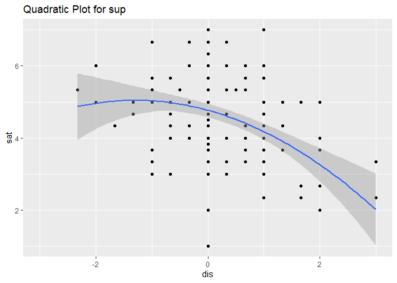
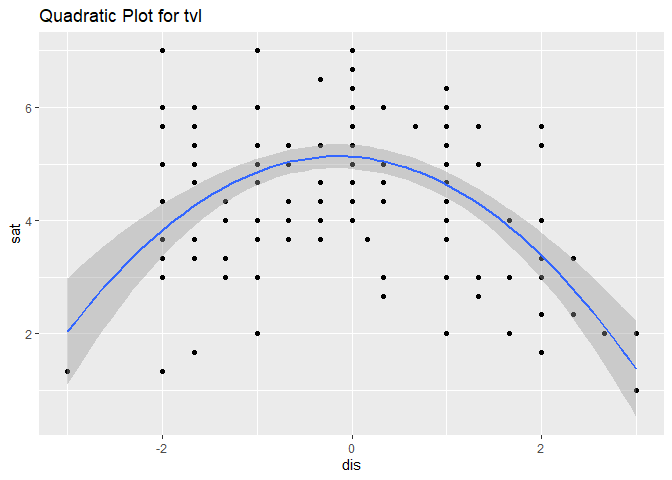

HW \#4: Curvilinear and Piecewise Linear Effects
================
Daniel Lewis
January 13, 2020

# Set up working environment

Load packages

``` r
# Tidyverse #
library(readxl)
library(rlang)
library(broom)
library(corrr)
library(glue)
library(magrittr)
library(tidyverse)

# Markdown #
library(rmarkdown)
library(tinytex)
library(knitr)
library(printr)
library(kableExtra)
library(citr)
library(pander)

# Other #
library(psych)
library(here)
```

# 1\. Piecewise vs. Polynomial Regression

According to Neter et al. ([1989](#ref-neter1989)), piecewise linear
regression is useful when there is a linear relationship between the
independent and dependent variables, but that linear relationship varies
depending on the subset of the range of the independent variable. So,
for example, somebody who is lonely will seek out other people to be
with, but someone above a certain critical point of loneliness will stay
isolated instead. The effect of loneliness changes after a certain
point.

The advantage of piecewise linear regression is that it can account for
a change in a theoretical effect. It is also relatively simple to
interpret, because it is still essentially a linear relationship: a unit
change in \(X\) creates a \(\beta_1\) change in \(Y\). A disadvantage is
that few effects in nature should have dramatic changes in their effects
at a single point.

Polynomial regression makes the opposite tradeoffs. It is more difficult
to interpret a quadratic (let alone a higher-order) term than a linear
term, but it is more theoretically justifiable because it is
continuously changing and has a more gradual change in slope at its
inflection.

According to Pedhazur & Schmelkin ([1991](#ref-pedhazur1991), p. 452),
theoretical considerations come first. Does the theory suggest a
piecewise effect? Or does it suggest a polynomial model would better
represent the true effect?

# 2\. Piecewise Regression

## Setup

First, I imported the data and made the variable names lowercase.

``` r
tbl.2 <- read_xlsx(here('data', 'nonlin.xlsx'))
colnames(tbl.2) <- tolower(colnames(tbl.2))
```

Then I looked at the raw data and descriptive statistics.

``` r
ks <- function(x, c) {
  kable(x, caption = c, escape = F, digits = 3) %>%
  kable_styling(full_width = F, position = 'left',
                bootstrap_options = c("striped", "hover", "condensed"))
  }

ks(tbl.2[1:10,], 'Job Satisfaction Data (first 10 observations)')
```

<table class="table table-striped table-hover table-condensed" style="width: auto !important; ">

<caption>

Job Satisfaction Data (first 10 observations)

</caption>

<thead>

<tr>

<th style="text-align:right;">

comd

</th>

<th style="text-align:right;">

coms

</th>

<th style="text-align:right;">

payd

</th>

<th style="text-align:right;">

pays

</th>

<th style="text-align:right;">

socd

</th>

<th style="text-align:right;">

socs

</th>

<th style="text-align:right;">

supd

</th>

<th style="text-align:right;">

sups

</th>

<th style="text-align:right;">

tvld

</th>

<th style="text-align:right;">

tvls

</th>

<th style="text-align:right;">

vard

</th>

<th style="text-align:right;">

vars

</th>

</tr>

</thead>

<tbody>

<tr>

<td style="text-align:right;">

0.000

</td>

<td style="text-align:right;">

6.000

</td>

<td style="text-align:right;">

\-1.333

</td>

<td style="text-align:right;">

3.333

</td>

<td style="text-align:right;">

0.000

</td>

<td style="text-align:right;">

5.000

</td>

<td style="text-align:right;">

0.333

</td>

<td style="text-align:right;">

3.000

</td>

<td style="text-align:right;">

2.000

</td>

<td style="text-align:right;">

5.333

</td>

<td style="text-align:right;">

\-1.000

</td>

<td style="text-align:right;">

6.000

</td>

</tr>

<tr>

<td style="text-align:right;">

0.000

</td>

<td style="text-align:right;">

6.333

</td>

<td style="text-align:right;">

\-1.667

</td>

<td style="text-align:right;">

6.333

</td>

<td style="text-align:right;">

0.000

</td>

<td style="text-align:right;">

6.667

</td>

<td style="text-align:right;">

1.333

</td>

<td style="text-align:right;">

4.333

</td>

<td style="text-align:right;">

0.000

</td>

<td style="text-align:right;">

6.667

</td>

<td style="text-align:right;">

1.000

</td>

<td style="text-align:right;">

4.667

</td>

</tr>

<tr>

<td style="text-align:right;">

0.000

</td>

<td style="text-align:right;">

4.000

</td>

<td style="text-align:right;">

0.000

</td>

<td style="text-align:right;">

5.667

</td>

<td style="text-align:right;">

\-0.333

</td>

<td style="text-align:right;">

4.000

</td>

<td style="text-align:right;">

1.000

</td>

<td style="text-align:right;">

3.333

</td>

<td style="text-align:right;">

0.000

</td>

<td style="text-align:right;">

4.000

</td>

<td style="text-align:right;">

\-1.000

</td>

<td style="text-align:right;">

3.000

</td>

</tr>

<tr>

<td style="text-align:right;">

0.000

</td>

<td style="text-align:right;">

7.000

</td>

<td style="text-align:right;">

\-1.000

</td>

<td style="text-align:right;">

6.000

</td>

<td style="text-align:right;">

0.000

</td>

<td style="text-align:right;">

4.667

</td>

<td style="text-align:right;">

0.000

</td>

<td style="text-align:right;">

5.000

</td>

<td style="text-align:right;">

0.000

</td>

<td style="text-align:right;">

6.000

</td>

<td style="text-align:right;">

\-1.000

</td>

<td style="text-align:right;">

5.000

</td>

</tr>

<tr>

<td style="text-align:right;">

0.333

</td>

<td style="text-align:right;">

5.000

</td>

<td style="text-align:right;">

0.000

</td>

<td style="text-align:right;">

7.000

</td>

<td style="text-align:right;">

1.000

</td>

<td style="text-align:right;">

6.000

</td>

<td style="text-align:right;">

1.000

</td>

<td style="text-align:right;">

6.000

</td>

<td style="text-align:right;">

1.000

</td>

<td style="text-align:right;">

6.000

</td>

<td style="text-align:right;">

0.000

</td>

<td style="text-align:right;">

7.000

</td>

</tr>

<tr>

<td style="text-align:right;">

1.000

</td>

<td style="text-align:right;">

3.000

</td>

<td style="text-align:right;">

\-2.000

</td>

<td style="text-align:right;">

5.000

</td>

<td style="text-align:right;">

\-1.000

</td>

<td style="text-align:right;">

5.000

</td>

<td style="text-align:right;">

\-0.333

</td>

<td style="text-align:right;">

5.000

</td>

<td style="text-align:right;">

1.000

</td>

<td style="text-align:right;">

3.667

</td>

<td style="text-align:right;">

\-1.667

</td>

<td style="text-align:right;">

5.000

</td>

</tr>

<tr>

<td style="text-align:right;">

2.000

</td>

<td style="text-align:right;">

2.000

</td>

<td style="text-align:right;">

\-2.000

</td>

<td style="text-align:right;">

2.667

</td>

<td style="text-align:right;">

\-0.667

</td>

<td style="text-align:right;">

4.000

</td>

<td style="text-align:right;">

0.000

</td>

<td style="text-align:right;">

5.333

</td>

<td style="text-align:right;">

\-2.000

</td>

<td style="text-align:right;">

3.667

</td>

<td style="text-align:right;">

\-0.333

</td>

<td style="text-align:right;">

5.000

</td>

</tr>

<tr>

<td style="text-align:right;">

0.333

</td>

<td style="text-align:right;">

3.000

</td>

<td style="text-align:right;">

\-0.333

</td>

<td style="text-align:right;">

7.000

</td>

<td style="text-align:right;">

0.000

</td>

<td style="text-align:right;">

7.000

</td>

<td style="text-align:right;">

0.000

</td>

<td style="text-align:right;">

6.667

</td>

<td style="text-align:right;">

0.000

</td>

<td style="text-align:right;">

7.000

</td>

<td style="text-align:right;">

0.000

</td>

<td style="text-align:right;">

7.000

</td>

</tr>

<tr>

<td style="text-align:right;">

1.000

</td>

<td style="text-align:right;">

3.000

</td>

<td style="text-align:right;">

\-1.000

</td>

<td style="text-align:right;">

7.000

</td>

<td style="text-align:right;">

0.000

</td>

<td style="text-align:right;">

6.333

</td>

<td style="text-align:right;">

0.000

</td>

<td style="text-align:right;">

6.000

</td>

<td style="text-align:right;">

2.000

</td>

<td style="text-align:right;">

3.000

</td>

<td style="text-align:right;">

\-1.333

</td>

<td style="text-align:right;">

5.000

</td>

</tr>

<tr>

<td style="text-align:right;">

2.000

</td>

<td style="text-align:right;">

3.000

</td>

<td style="text-align:right;">

\-0.667

</td>

<td style="text-align:right;">

3.333

</td>

<td style="text-align:right;">

0.000

</td>

<td style="text-align:right;">

4.000

</td>

<td style="text-align:right;">

\-0.333

</td>

<td style="text-align:right;">

4.000

</td>

<td style="text-align:right;">

1.333

</td>

<td style="text-align:right;">

3.000

</td>

<td style="text-align:right;">

0.000

</td>

<td style="text-align:right;">

4.000

</td>

</tr>

</tbody>

</table>

``` r
describe(tbl.2) %>%
  ks('Descriptive Statistics')
```

<table class="table table-striped table-hover table-condensed" style="width: auto !important; ">

<caption>

Descriptive Statistics

</caption>

<thead>

<tr>

<th style="text-align:left;">

</th>

<th style="text-align:right;">

vars

</th>

<th style="text-align:right;">

n

</th>

<th style="text-align:right;">

mean

</th>

<th style="text-align:right;">

sd

</th>

<th style="text-align:right;">

median

</th>

<th style="text-align:right;">

trimmed

</th>

<th style="text-align:right;">

mad

</th>

<th style="text-align:right;">

min

</th>

<th style="text-align:right;">

max

</th>

<th style="text-align:right;">

range

</th>

<th style="text-align:right;">

skew

</th>

<th style="text-align:right;">

kurtosis

</th>

<th style="text-align:right;">

se

</th>

</tr>

</thead>

<tbody>

<tr>

<td style="text-align:left;">

comd

</td>

<td style="text-align:right;">

1

</td>

<td style="text-align:right;">

185

</td>

<td style="text-align:right;">

0.492

</td>

<td style="text-align:right;">

0.883

</td>

<td style="text-align:right;">

0.000

</td>

<td style="text-align:right;">

0.434

</td>

<td style="text-align:right;">

0.494

</td>

<td style="text-align:right;">

\-2.000

</td>

<td style="text-align:right;">

3.000

</td>

<td style="text-align:right;">

5.000

</td>

<td style="text-align:right;">

0.579

</td>

<td style="text-align:right;">

0.190

</td>

<td style="text-align:right;">

0.065

</td>

</tr>

<tr>

<td style="text-align:left;">

coms

</td>

<td style="text-align:right;">

2

</td>

<td style="text-align:right;">

185

</td>

<td style="text-align:right;">

4.536

</td>

<td style="text-align:right;">

1.469

</td>

<td style="text-align:right;">

4.333

</td>

<td style="text-align:right;">

4.538

</td>

<td style="text-align:right;">

1.977

</td>

<td style="text-align:right;">

1.000

</td>

<td style="text-align:right;">

7.000

</td>

<td style="text-align:right;">

6.000

</td>

<td style="text-align:right;">

0.011

</td>

<td style="text-align:right;">

\-0.853

</td>

<td style="text-align:right;">

0.108

</td>

</tr>

<tr>

<td style="text-align:left;">

payd

</td>

<td style="text-align:right;">

3

</td>

<td style="text-align:right;">

185

</td>

<td style="text-align:right;">

\-1.314

</td>

<td style="text-align:right;">

0.932

</td>

<td style="text-align:right;">

\-1.333

</td>

<td style="text-align:right;">

\-1.280

</td>

<td style="text-align:right;">

0.988

</td>

<td style="text-align:right;">

\-3.000

</td>

<td style="text-align:right;">

0.333

</td>

<td style="text-align:right;">

3.333

</td>

<td style="text-align:right;">

\-0.070

</td>

<td style="text-align:right;">

\-1.061

</td>

<td style="text-align:right;">

0.069

</td>

</tr>

<tr>

<td style="text-align:left;">

pays

</td>

<td style="text-align:right;">

4

</td>

<td style="text-align:right;">

185

</td>

<td style="text-align:right;">

4.948

</td>

<td style="text-align:right;">

1.514

</td>

<td style="text-align:right;">

5.000

</td>

<td style="text-align:right;">

5.051

</td>

<td style="text-align:right;">

1.483

</td>

<td style="text-align:right;">

1.000

</td>

<td style="text-align:right;">

7.000

</td>

<td style="text-align:right;">

6.000

</td>

<td style="text-align:right;">

\-0.545

</td>

<td style="text-align:right;">

\-0.439

</td>

<td style="text-align:right;">

0.111

</td>

</tr>

<tr>

<td style="text-align:left;">

socd

</td>

<td style="text-align:right;">

5

</td>

<td style="text-align:right;">

185

</td>

<td style="text-align:right;">

\-0.189

</td>

<td style="text-align:right;">

0.772

</td>

<td style="text-align:right;">

0.000

</td>

<td style="text-align:right;">

\-0.228

</td>

<td style="text-align:right;">

0.000

</td>

<td style="text-align:right;">

\-2.333

</td>

<td style="text-align:right;">

2.667

</td>

<td style="text-align:right;">

5.000

</td>

<td style="text-align:right;">

0.468

</td>

<td style="text-align:right;">

1.872

</td>

<td style="text-align:right;">

0.057

</td>

</tr>

<tr>

<td style="text-align:left;">

socs

</td>

<td style="text-align:right;">

6

</td>

<td style="text-align:right;">

185

</td>

<td style="text-align:right;">

4.637

</td>

<td style="text-align:right;">

1.196

</td>

<td style="text-align:right;">

4.333

</td>

<td style="text-align:right;">

4.628

</td>

<td style="text-align:right;">

0.988

</td>

<td style="text-align:right;">

1.000

</td>

<td style="text-align:right;">

7.000

</td>

<td style="text-align:right;">

6.000

</td>

<td style="text-align:right;">

0.012

</td>

<td style="text-align:right;">

0.015

</td>

<td style="text-align:right;">

0.088

</td>

</tr>

<tr>

<td style="text-align:left;">

supd

</td>

<td style="text-align:right;">

7

</td>

<td style="text-align:right;">

185

</td>

<td style="text-align:right;">

0.213

</td>

<td style="text-align:right;">

0.869

</td>

<td style="text-align:right;">

0.000

</td>

<td style="text-align:right;">

0.204

</td>

<td style="text-align:right;">

0.741

</td>

<td style="text-align:right;">

\-2.333

</td>

<td style="text-align:right;">

3.000

</td>

<td style="text-align:right;">

5.333

</td>

<td style="text-align:right;">

0.176

</td>

<td style="text-align:right;">

0.904

</td>

<td style="text-align:right;">

0.064

</td>

</tr>

<tr>

<td style="text-align:left;">

sups

</td>

<td style="text-align:right;">

8

</td>

<td style="text-align:right;">

185

</td>

<td style="text-align:right;">

4.546

</td>

<td style="text-align:right;">

1.218

</td>

<td style="text-align:right;">

4.333

</td>

<td style="text-align:right;">

4.537

</td>

<td style="text-align:right;">

1.483

</td>

<td style="text-align:right;">

1.000

</td>

<td style="text-align:right;">

7.000

</td>

<td style="text-align:right;">

6.000

</td>

<td style="text-align:right;">

\-0.027

</td>

<td style="text-align:right;">

\-0.396

</td>

<td style="text-align:right;">

0.090

</td>

</tr>

<tr>

<td style="text-align:left;">

tvld

</td>

<td style="text-align:right;">

9

</td>

<td style="text-align:right;">

185

</td>

<td style="text-align:right;">

0.044

</td>

<td style="text-align:right;">

1.142

</td>

<td style="text-align:right;">

0.000

</td>

<td style="text-align:right;">

0.030

</td>

<td style="text-align:right;">

1.483

</td>

<td style="text-align:right;">

\-3.000

</td>

<td style="text-align:right;">

3.000

</td>

<td style="text-align:right;">

6.000

</td>

<td style="text-align:right;">

0.084

</td>

<td style="text-align:right;">

\-0.184

</td>

<td style="text-align:right;">

0.084

</td>

</tr>

<tr>

<td style="text-align:left;">

tvls

</td>

<td style="text-align:right;">

10

</td>

<td style="text-align:right;">

185

</td>

<td style="text-align:right;">

4.626

</td>

<td style="text-align:right;">

1.369

</td>

<td style="text-align:right;">

4.667

</td>

<td style="text-align:right;">

4.643

</td>

<td style="text-align:right;">

1.483

</td>

<td style="text-align:right;">

1.000

</td>

<td style="text-align:right;">

7.000

</td>

<td style="text-align:right;">

6.000

</td>

<td style="text-align:right;">

\-0.193

</td>

<td style="text-align:right;">

\-0.406

</td>

<td style="text-align:right;">

0.101

</td>

</tr>

<tr>

<td style="text-align:left;">

vard

</td>

<td style="text-align:right;">

11

</td>

<td style="text-align:right;">

185

</td>

<td style="text-align:right;">

\-0.721

</td>

<td style="text-align:right;">

0.859

</td>

<td style="text-align:right;">

\-0.667

</td>

<td style="text-align:right;">

\-0.660

</td>

<td style="text-align:right;">

0.988

</td>

<td style="text-align:right;">

\-3.000

</td>

<td style="text-align:right;">

1.667

</td>

<td style="text-align:right;">

4.667

</td>

<td style="text-align:right;">

\-0.435

</td>

<td style="text-align:right;">

0.264

</td>

<td style="text-align:right;">

0.063

</td>

</tr>

<tr>

<td style="text-align:left;">

vars

</td>

<td style="text-align:right;">

12

</td>

<td style="text-align:right;">

185

</td>

<td style="text-align:right;">

5.257

</td>

<td style="text-align:right;">

1.239

</td>

<td style="text-align:right;">

5.333

</td>

<td style="text-align:right;">

5.334

</td>

<td style="text-align:right;">

0.988

</td>

<td style="text-align:right;">

1.333

</td>

<td style="text-align:right;">

7.000

</td>

<td style="text-align:right;">

5.667

</td>

<td style="text-align:right;">

\-0.445

</td>

<td style="text-align:right;">

\-0.256

</td>

<td style="text-align:right;">

0.091

</td>

</tr>

</tbody>

</table>

It looks like we have 12 variables, or six pairs of discrepancy and
satisfaction variables. The discrepancy variables range from about -3 to
about 3 and the satisfaction variables range from about 1 to 7, so
everything matches the description in the assignment.

Next, I created dummy-coded variables for \(X_2\), such that the
variable would be 0 when the discrepancy variable was less than 0 and 1
otherwise. I also multiplied \(X_2\) by the discrepancy variable,
\(X_1\), to create the product term in Equation 10.24 (Neter et al.,
[1989](#ref-neter1989), p. 370).

``` r
vec.2 <- tbl.2 %>%
  colnames() %>%
  str_sub(1, 3) %>%
  unique()

vec.2.d <- vec.2 %>%
  paste('d', sep = '')

tbl.2.a <- tbl.2 %>%
  mutate_at(vec.2.d, list(f = ~ ifelse(. >= 0, 1, 0), p = ~ (. >= 0) * .)) %>%
  rename_all(~ str_remove(., 'd_'))
```

## Constrained Piecewise Regression

Once I had the dummy-coded variables and product terms ready, I created
six piecewise functions and estimated their parameters.

``` r
# in:  att = 3-character name of attribute
# out: piecewise linear function
fun.2 <- function(att, data) {
  f <- paste(att, 's ~ ', att, 'd + ', att, 'p', sep = '') %>%
    as.formula()
  f %>%
    lm(data)
}

tbl.2.b <- vec.2 %>%
  map_df(~ fun.2(., tbl.2.a) %>% tidy())

tbl.2.b %>%
  ks('Regression Output for Piecewise Functions')
```

<table class="table table-striped table-hover table-condensed" style="width: auto !important; ">

<caption>

Regression Output for Piecewise Functions

</caption>

<thead>

<tr>

<th style="text-align:left;">

term

</th>

<th style="text-align:right;">

estimate

</th>

<th style="text-align:right;">

std.error

</th>

<th style="text-align:right;">

statistic

</th>

<th style="text-align:right;">

p.value

</th>

</tr>

</thead>

<tbody>

<tr>

<td style="text-align:left;">

(Intercept)

</td>

<td style="text-align:right;">

5.110

</td>

<td style="text-align:right;">

0.122

</td>

<td style="text-align:right;">

42.014

</td>

<td style="text-align:right;">

0.000

</td>

</tr>

<tr>

<td style="text-align:left;">

comd

</td>

<td style="text-align:right;">

0.513

</td>

<td style="text-align:right;">

0.343

</td>

<td style="text-align:right;">

1.494

</td>

<td style="text-align:right;">

0.137

</td>

</tr>

<tr>

<td style="text-align:left;">

comp

</td>

<td style="text-align:right;">

\-1.465

</td>

<td style="text-align:right;">

0.385

</td>

<td style="text-align:right;">

\-3.808

</td>

<td style="text-align:right;">

0.000

</td>

</tr>

<tr>

<td style="text-align:left;">

(Intercept)

</td>

<td style="text-align:right;">

5.967

</td>

<td style="text-align:right;">

0.172

</td>

<td style="text-align:right;">

34.625

</td>

<td style="text-align:right;">

0.000

</td>

</tr>

<tr>

<td style="text-align:left;">

payd

</td>

<td style="text-align:right;">

0.775

</td>

<td style="text-align:right;">

0.107

</td>

<td style="text-align:right;">

7.254

</td>

<td style="text-align:right;">

0.000

</td>

</tr>

<tr>

<td style="text-align:left;">

payp

</td>

<td style="text-align:right;">

\-0.675

</td>

<td style="text-align:right;">

4.062

</td>

<td style="text-align:right;">

\-0.166

</td>

<td style="text-align:right;">

0.868

</td>

</tr>

<tr>

<td style="text-align:left;">

(Intercept)

</td>

<td style="text-align:right;">

5.034

</td>

<td style="text-align:right;">

0.103

</td>

<td style="text-align:right;">

48.741

</td>

<td style="text-align:right;">

0.000

</td>

</tr>

<tr>

<td style="text-align:left;">

socd

</td>

<td style="text-align:right;">

0.723

</td>

<td style="text-align:right;">

0.155

</td>

<td style="text-align:right;">

4.667

</td>

<td style="text-align:right;">

0.000

</td>

</tr>

<tr>

<td style="text-align:left;">

socp

</td>

<td style="text-align:right;">

\-1.678

</td>

<td style="text-align:right;">

0.262

</td>

<td style="text-align:right;">

\-6.394

</td>

<td style="text-align:right;">

0.000

</td>

</tr>

<tr>

<td style="text-align:left;">

(Intercept)

</td>

<td style="text-align:right;">

4.906

</td>

<td style="text-align:right;">

0.112

</td>

<td style="text-align:right;">

43.733

</td>

<td style="text-align:right;">

0.000

</td>

</tr>

<tr>

<td style="text-align:left;">

supd

</td>

<td style="text-align:right;">

0.036

</td>

<td style="text-align:right;">

0.192

</td>

<td style="text-align:right;">

0.185

</td>

<td style="text-align:right;">

0.853

</td>

</tr>

<tr>

<td style="text-align:left;">

supp

</td>

<td style="text-align:right;">

\-0.889

</td>

<td style="text-align:right;">

0.267

</td>

<td style="text-align:right;">

\-3.327

</td>

<td style="text-align:right;">

0.001

</td>

</tr>

<tr>

<td style="text-align:left;">

(Intercept)

</td>

<td style="text-align:right;">

5.373

</td>

<td style="text-align:right;">

0.124

</td>

<td style="text-align:right;">

43.353

</td>

<td style="text-align:right;">

0.000

</td>

</tr>

<tr>

<td style="text-align:left;">

tvld

</td>

<td style="text-align:right;">

0.762

</td>

<td style="text-align:right;">

0.137

</td>

<td style="text-align:right;">

5.558

</td>

<td style="text-align:right;">

0.000

</td>

</tr>

<tr>

<td style="text-align:left;">

tvlp

</td>

<td style="text-align:right;">

\-1.793

</td>

<td style="text-align:right;">

0.218

</td>

<td style="text-align:right;">

\-8.225

</td>

<td style="text-align:right;">

0.000

</td>

</tr>

<tr>

<td style="text-align:left;">

(Intercept)

</td>

<td style="text-align:right;">

5.767

</td>

<td style="text-align:right;">

0.121

</td>

<td style="text-align:right;">

47.699

</td>

<td style="text-align:right;">

0.000

</td>

</tr>

<tr>

<td style="text-align:left;">

vard

</td>

<td style="text-align:right;">

0.628

</td>

<td style="text-align:right;">

0.108

</td>

<td style="text-align:right;">

5.813

</td>

<td style="text-align:right;">

0.000

</td>

</tr>

<tr>

<td style="text-align:left;">

varp

</td>

<td style="text-align:right;">

\-1.400

</td>

<td style="text-align:right;">

0.433

</td>

<td style="text-align:right;">

\-3.232

</td>

<td style="text-align:right;">

0.001

</td>

</tr>

</tbody>

</table>

The (Intercept), d, and p terms correspond to \(\beta_0\), \(\beta_1\),
and \(\beta_2\), respectively. So, for example, the piecewise model for
commute time has a \(\hat{\beta_1}\) of 0.513.

Are the functions symmetric about 0? That is equivalent to the
hypothesis \[\beta_2 = -2\beta_1\], because \(\beta_2\) is the
additional slope added to \(\beta_1\) when \(X_1 > 0\). When it is
\(-2\beta_1\), the slopes for the two pieces of the function will be
\(\beta_1\) and \(\beta_1 + \beta_2 = \beta_1 - 2\beta_1 = -\beta_1\).

To test this hypothesis, I computed \(\beta_2 - 2\beta_1\) for each
model.

``` r
tbl.2.c <- tbl.2.b %>%
  mutate(att = vec.2 %>% rep(each = 3))

tbl.2.c %>%
  filter(term != '(Intercept)') %>%
  group_by(att) %>%
  summarise(diff = (function(x) x[2] - 2 * x[1])(estimate)) %>%
  ks('Tests of Symmetry Hypothesis')
```

<table class="table table-striped table-hover table-condensed" style="width: auto !important; ">

<caption>

Tests of Symmetry Hypothesis

</caption>

<thead>

<tr>

<th style="text-align:left;">

att

</th>

<th style="text-align:right;">

diff

</th>

</tr>

</thead>

<tbody>

<tr>

<td style="text-align:left;">

com

</td>

<td style="text-align:right;">

\-2.491

</td>

</tr>

<tr>

<td style="text-align:left;">

pay

</td>

<td style="text-align:right;">

\-2.225

</td>

</tr>

<tr>

<td style="text-align:left;">

soc

</td>

<td style="text-align:right;">

\-3.124

</td>

</tr>

<tr>

<td style="text-align:left;">

sup

</td>

<td style="text-align:right;">

\-0.960

</td>

</tr>

<tr>

<td style="text-align:left;">

tvl

</td>

<td style="text-align:right;">

\-3.318

</td>

</tr>

<tr>

<td style="text-align:left;">

var

</td>

<td style="text-align:right;">

\-2.656

</td>

</tr>

</tbody>

</table>

The results show that only closeness of supervision might be
symmetrical. Without doing an inference test, I don’t whether it is
significantly different from 0, but I feel confident that all the others
are very different from 0.

To visualize the results, I plotted each model.

``` r
fun.2.b <- function(att, data) {
  str.1 <- paste(att, 'd', sep = '')
  str.2 <- paste(att, 's', sep = '')
  str.3 <- paste(att, 'p', sep = '')
  dbl.1 <- data[[str.1]]
  dbl.2 <- c(min(dbl.1), 0, max(dbl.1))
  tbl.1 <- tibble(!!str.1 := dbl.2,
                  !!str.3 := c(0, 0, max(dbl.1)))
  fit.1 <- fun.2(att, data)
  dbl.3 <- predict(fit.1, tbl.1)
  
  tbl.2.a %>%
    ggplot(aes_string(x = str.1, y = str.2)) +
    geom_segment(aes(x = dbl.2[1], y = dbl.3[1],
                     xend = dbl.2[2], yend = dbl.3[2])) +
    geom_segment(aes(x = dbl.2[2], y = dbl.3[2],
                     xend = dbl.2[3], yend = dbl.3[3])) +
    geom_point(size = 1) +
    labs(x = str.1, y = str.2, title = paste("Piecewise Plot of", att)) +
    xlim(-3, 3)
}

vec.2 %>%
  map(~ fun.2.b(., tbl.2.a))
```

<!-- --><!-- --><!-- --><!-- --><!-- --><!-- -->

Interesting. The model for closeness of supervision (sup) looks like the
least symmetrical attribute, perhaps only after pay, which has
hilariously little data above payd = 0. The plot of travel looks the
most symmetrical. I’m not sure what I did wrong.

## Discontinuous Piecewise Regression

I reran the same analysis, this time giving parameters to both
\(X_1 \times X_2\) and \(X_2\), as described in Equation 10.27 (Neter et
al., [1989](#ref-neter1989), p. 373).

``` r
# in:  att = 3-character name of attribute
# out: discontinuous piecewise linear function
fun.2.c <- function(att, data) {
  paste(att, 's ~ ', att, 'd + ', att, 'p +', att, 'f', sep = '') %>%
    as.formula() %>%
    lm(data)
}

tbl.2.f <- vec.2 %>%
  map_df(~ fun.2.c(., tbl.2.a) %>% tidy())

tbl.2.f %>%
  ks('Regression Output for Discontinuous Piecewise Functions')
```

<table class="table table-striped table-hover table-condensed" style="width: auto !important; ">

<caption>

Regression Output for Discontinuous Piecewise Functions

</caption>

<thead>

<tr>

<th style="text-align:left;">

term

</th>

<th style="text-align:right;">

estimate

</th>

<th style="text-align:right;">

std.error

</th>

<th style="text-align:right;">

statistic

</th>

<th style="text-align:right;">

p.value

</th>

</tr>

</thead>

<tbody>

<tr>

<td style="text-align:left;">

(Intercept)

</td>

<td style="text-align:right;">

4.029

</td>

<td style="text-align:right;">

0.605

</td>

<td style="text-align:right;">

6.659

</td>

<td style="text-align:right;">

0.000

</td>

</tr>

<tr>

<td style="text-align:left;">

comd

</td>

<td style="text-align:right;">

\-0.428

</td>

<td style="text-align:right;">

0.618

</td>

<td style="text-align:right;">

\-0.692

</td>

<td style="text-align:right;">

0.490

</td>

</tr>

<tr>

<td style="text-align:left;">

comp

</td>

<td style="text-align:right;">

\-0.552

</td>

<td style="text-align:right;">

0.630

</td>

<td style="text-align:right;">

\-0.877

</td>

<td style="text-align:right;">

0.382

</td>

</tr>

<tr>

<td style="text-align:left;">

comf

</td>

<td style="text-align:right;">

1.126

</td>

<td style="text-align:right;">

0.617

</td>

<td style="text-align:right;">

1.824

</td>

<td style="text-align:right;">

0.070

</td>

</tr>

<tr>

<td style="text-align:left;">

(Intercept)

</td>

<td style="text-align:right;">

5.683

</td>

<td style="text-align:right;">

0.255

</td>

<td style="text-align:right;">

22.279

</td>

<td style="text-align:right;">

0.000

</td>

</tr>

<tr>

<td style="text-align:left;">

payd

</td>

<td style="text-align:right;">

0.631

</td>

<td style="text-align:right;">

0.143

</td>

<td style="text-align:right;">

4.403

</td>

<td style="text-align:right;">

0.000

</td>

</tr>

<tr>

<td style="text-align:left;">

payp

</td>

<td style="text-align:right;">

\-1.237

</td>

<td style="text-align:right;">

4.065

</td>

<td style="text-align:right;">

\-0.304

</td>

<td style="text-align:right;">

0.761

</td>

</tr>

<tr>

<td style="text-align:left;">

payf

</td>

<td style="text-align:right;">

0.519

</td>

<td style="text-align:right;">

0.345

</td>

<td style="text-align:right;">

1.504

</td>

<td style="text-align:right;">

0.134

</td>

</tr>

<tr>

<td style="text-align:left;">

(Intercept)

</td>

<td style="text-align:right;">

5.084

</td>

<td style="text-align:right;">

0.315

</td>

<td style="text-align:right;">

16.147

</td>

<td style="text-align:right;">

0.000

</td>

</tr>

<tr>

<td style="text-align:left;">

socd

</td>

<td style="text-align:right;">

0.766

</td>

<td style="text-align:right;">

0.300

</td>

<td style="text-align:right;">

2.553

</td>

<td style="text-align:right;">

0.012

</td>

</tr>

<tr>

<td style="text-align:left;">

socp

</td>

<td style="text-align:right;">

\-1.717

</td>

<td style="text-align:right;">

0.351

</td>

<td style="text-align:right;">

\-4.888

</td>

<td style="text-align:right;">

0.000

</td>

</tr>

<tr>

<td style="text-align:left;">

socf

</td>

<td style="text-align:right;">

\-0.056

</td>

<td style="text-align:right;">

0.333

</td>

<td style="text-align:right;">

\-0.169

</td>

<td style="text-align:right;">

0.866

</td>

</tr>

<tr>

<td style="text-align:left;">

(Intercept)

</td>

<td style="text-align:right;">

4.741

</td>

<td style="text-align:right;">

0.342

</td>

<td style="text-align:right;">

13.865

</td>

<td style="text-align:right;">

0.000

</td>

</tr>

<tr>

<td style="text-align:left;">

supd

</td>

<td style="text-align:right;">

\-0.104

</td>

<td style="text-align:right;">

0.335

</td>

<td style="text-align:right;">

\-0.312

</td>

<td style="text-align:right;">

0.756

</td>

</tr>

<tr>

<td style="text-align:left;">

supp

</td>

<td style="text-align:right;">

\-0.764

</td>

<td style="text-align:right;">

0.363

</td>

<td style="text-align:right;">

\-2.104

</td>

<td style="text-align:right;">

0.037

</td>

</tr>

<tr>

<td style="text-align:left;">

supf

</td>

<td style="text-align:right;">

0.185

</td>

<td style="text-align:right;">

0.362

</td>

<td style="text-align:right;">

0.511

</td>

<td style="text-align:right;">

0.610

</td>

</tr>

<tr>

<td style="text-align:left;">

(Intercept)

</td>

<td style="text-align:right;">

4.872

</td>

<td style="text-align:right;">

0.356

</td>

<td style="text-align:right;">

13.694

</td>

<td style="text-align:right;">

0.000

</td>

</tr>

<tr>

<td style="text-align:left;">

tvld

</td>

<td style="text-align:right;">

0.434

</td>

<td style="text-align:right;">

0.258

</td>

<td style="text-align:right;">

1.683

</td>

<td style="text-align:right;">

0.094

</td>

</tr>

<tr>

<td style="text-align:left;">

tvlp

</td>

<td style="text-align:right;">

\-1.507

</td>

<td style="text-align:right;">

0.289

</td>

<td style="text-align:right;">

\-5.217

</td>

<td style="text-align:right;">

0.000

</td>

</tr>

<tr>

<td style="text-align:left;">

tvlf

</td>

<td style="text-align:right;">

0.569

</td>

<td style="text-align:right;">

0.379

</td>

<td style="text-align:right;">

1.501

</td>

<td style="text-align:right;">

0.135

</td>

</tr>

<tr>

<td style="text-align:left;">

(Intercept)

</td>

<td style="text-align:right;">

5.015

</td>

<td style="text-align:right;">

0.215

</td>

<td style="text-align:right;">

23.338

</td>

<td style="text-align:right;">

0.000

</td>

</tr>

<tr>

<td style="text-align:left;">

vard

</td>

<td style="text-align:right;">

0.153

</td>

<td style="text-align:right;">

0.154

</td>

<td style="text-align:right;">

0.989

</td>

<td style="text-align:right;">

0.324

</td>

</tr>

<tr>

<td style="text-align:left;">

varp

</td>

<td style="text-align:right;">

\-1.194

</td>

<td style="text-align:right;">

0.418

</td>

<td style="text-align:right;">

\-2.856

</td>

<td style="text-align:right;">

0.005

</td>

</tr>

<tr>

<td style="text-align:left;">

varf

</td>

<td style="text-align:right;">

1.061

</td>

<td style="text-align:right;">

0.255

</td>

<td style="text-align:right;">

4.160

</td>

<td style="text-align:right;">

0.000

</td>

</tr>

</tbody>

</table>

In this output, the terms that end in f correspond to \(\beta_3\) in
Equation 10.27. And when \(\beta_3\) is not 0, there is a discontinuity
where the discrepancy variable is 0. In the results table above, the
only case where a \(\beta_3\) appears to be approximately 0 is socf,
corresponding to span of control. For all the others, there is a jump at
0. And because they are all positive, I believe that means that the
there’s a jump *up* from less-than-adequate to adequate.

This analysis tells us that, with the exception of span of control, all
the attributes under consideration are discontinuous. And the fact that
the discontinuity is one-sided suggests that participants were less
dissatisfied with more-than-adequate attributes than with
less-than-adequate attributes.

Finally, before moving on to polynomial regression, let’s take a look at
the discontinuous model plots.

``` r
fun.2.b <- function(att, results, data) {
  res <- filter(results, att == att)[["estimate"]]
  str.1 <- paste(att, 'd', sep = '')
  str.2 <- paste(att, 's', sep = '')
  str.3 <- paste(att, 'p', sep = '')
  str.4 <- paste(att, 'f', sep = '')
  dbl.1 <- data[[str.1]]
  dbl.2 <- c(min(dbl.1), 0, max(dbl.1))
  tbl.1 <- tibble(!!str.1 := dbl.2,
                  !!str.3 := c(0, 0, max(dbl.1)),
                  !!str.4 := c(0, 1, 1))
  fit.1 <- fun.2.c(att, data)
  dbl.3 <- predict(fit.1, tbl.1)
  
  tbl.2.a %>%
    ggplot(aes_string(x = str.1, y = str.2)) +
    # Left piece
    geom_segment(aes(x = dbl.2[1], y = dbl.3[1],
                     xend = 0, yend = dbl.3[2] - res[4])) +
    # Jump
    geom_segment(aes(x = 0, y = dbl.3[2] - res[4],
                     xend = 0, yend = dbl.3[2])) +
    # Right piece
    geom_segment(aes(x = 0, y = dbl.3[2],
                     xend = dbl.2[3], yend = dbl.3[3])) +
    geom_point(size = 1) +
    labs(x = str.1, y = str.2, title = paste("Discontinuity Plot of", att))
}

vec.2 %>%
  map(~ fun.2.b(., tbl.2.c, tbl.2.a))
```

<!-- --><!-- --><!-- --><!-- --><!-- --><!-- -->

Across the board, they all have large jumps. That is a sign that the
constrained piecewise models were definitely inappropriate.

# 3\. Polynomial Regression

## Hierarchical Polynomial Regression

I followed the procedure in (Pedhazur & Schmelkin,
[1991](#ref-pedhazur1991)) for hierarchical polynomial regression. I
tested linear, quadratic, cubic, and quartic models and compared their
improvements in fit using the \(R^2\) difference test in Equation 18.15
(Pedhazur & Schmelkin, [1991](#ref-pedhazur1991), p. 432).

First, I had to do some data management. I collapsed all the
satisfaction variables into one variable called ‘sat’ and all the
discrepancy variables into one variable called ‘dis’, with a grouping
variable for the attributes called ‘att’.

``` r
tbl.3 <- tbl.2 %>%
  select_at(vars(ends_with('s'))) %>%
  stack() %>%
  as_tibble() %>%
  rename(sat = values, att = ind) %>%
  mutate(att = str_sub(att, 1, -2)) %>%
  add_column(dis = tbl.2 %>%
               select_at(vars(ends_with('d'))) %>%
               stack() %>% as_tibble() %>%
               pull("values")) %>%
  select(-att, everything())

tbl.3[1:10,] %>%
  ks('Rearranged Data (first 10 obs)')
```

<table class="table table-striped table-hover table-condensed" style="width: auto !important; ">

<caption>

Rearranged Data (first 10 obs)

</caption>

<thead>

<tr>

<th style="text-align:right;">

sat

</th>

<th style="text-align:right;">

dis

</th>

<th style="text-align:left;">

att

</th>

</tr>

</thead>

<tbody>

<tr>

<td style="text-align:right;">

6.000

</td>

<td style="text-align:right;">

0.000

</td>

<td style="text-align:left;">

com

</td>

</tr>

<tr>

<td style="text-align:right;">

6.333

</td>

<td style="text-align:right;">

0.000

</td>

<td style="text-align:left;">

com

</td>

</tr>

<tr>

<td style="text-align:right;">

4.000

</td>

<td style="text-align:right;">

0.000

</td>

<td style="text-align:left;">

com

</td>

</tr>

<tr>

<td style="text-align:right;">

7.000

</td>

<td style="text-align:right;">

0.000

</td>

<td style="text-align:left;">

com

</td>

</tr>

<tr>

<td style="text-align:right;">

5.000

</td>

<td style="text-align:right;">

0.333

</td>

<td style="text-align:left;">

com

</td>

</tr>

<tr>

<td style="text-align:right;">

3.000

</td>

<td style="text-align:right;">

1.000

</td>

<td style="text-align:left;">

com

</td>

</tr>

<tr>

<td style="text-align:right;">

2.000

</td>

<td style="text-align:right;">

2.000

</td>

<td style="text-align:left;">

com

</td>

</tr>

<tr>

<td style="text-align:right;">

3.000

</td>

<td style="text-align:right;">

0.333

</td>

<td style="text-align:left;">

com

</td>

</tr>

<tr>

<td style="text-align:right;">

3.000

</td>

<td style="text-align:right;">

1.000

</td>

<td style="text-align:left;">

com

</td>

</tr>

<tr>

<td style="text-align:right;">

3.000

</td>

<td style="text-align:right;">

2.000

</td>

<td style="text-align:left;">

com

</td>

</tr>

</tbody>

</table>

Second, I regressed sat on dis for each attribute. Note that I used raw
polynomials rather than orthogonal polynomials. Instead of showing the
output for all 24 (6 attributes &$ 4 orders) polynomial models, I
printed just the quadratic model for ‘com’ as an example.

``` r
fun.3.a <- function(ord) {
  f <- glue('fit{ord}')
  t <- glue('tdy{ord}')
  m <- glue('mod{ord}')
  exprs(!!{{f}} := map(data, ~ lm(sat ~ poly(dis, !!ord, raw = TRUE), .)),
        !!{{t}} := map(!!sym(f), tidy),
        !!{{m}} := map(!!sym(f), glance))
}

lst.3.a <- 1:4 %>%
  map(fun.3.a) %>%
  flatten()

tbl.3.a <- tbl.3 %>%
  nest(-att) %>%
  mutate(!!!lst.3.a)

tbl.3.a %>%
  select_at(vars(matches("fit2"))) %>%
    map(~ .[[1]] %>% tidy()) %>%
  unname() %>%
  pander()
```

  - 
    
    |           term            | estimate | std.error | statistic |  p.value  |
    | :-----------------------: | :------: | :-------: | :-------: | :-------: |
    |        (Intercept)        |  4.963   |  0.1125   |   44.1    | 4.323e-99 |
    | poly(dis, 2, raw = TRUE)1 | \-0.3653 |  0.1732   |  \-2.109  |  0.03634  |
    | poly(dis, 2, raw = TRUE)2 | \-0.2429 |  0.09002  |  \-2.698  | 0.007633  |
    

<!-- end of list -->

Third, I *tried* to compare model fit in order to determine the
highest-order model with significant improvement on its
next-lowest-order model.

``` r
fun.3.b <- function(att, ord, tbl) {
  results <- tbl %>%
    filter(att == !!att) %>%
    select_at(vars(matches(paste("fit", seq(ord), sep = '', collapse = '|')))) %>%
    map(~ .[[1]]) %>%
    unname() %>%
    do.call(what = anova)
}

lst.3.b <- vec.2 %>%
  map(~ map(.x = 1:4, .f = fun.3.b, att = ., tbl = tbl.3.a)) %>%
  set_names(vec.2)
```

But, as you can see, I did it wrong. I accidentally compared all 4
models for each attribute to each other all at once.

Fourth, I tried again.

``` r
fun.3.b.2 <- function(att, ord, tbl) {
  stopifnot(att %in% vec.2)
  stopifnot(ord >= 1 && ord <= 4)
  results <- tbl %>%
    filter(att == !!att) %>%
    select_at(vars(matches(paste("fit", max(ord-1, 1):ord,
                                 sep = '', collapse = '|')))) %>%
    map(~ .[[1]]) %>%
    unname() %>%
    do.call(what = anova)
  results
}

fun.3.c <- function(att, tbl) {
  helper <- function() {
    assign('r', fun.3.b.2(att, i, tbl), parent.frame())
    assign('p', as.vector(na.omit(r$`Pr(>F)`)), parent.frame())
  }
  i <- 1
  helper()
  p <- 0
  prev <- r
  while (i <= 4 && p < .05) {
    i = i + 1
    prev <- r
    helper()
  }
  if (p < .05) {
    r
  } else {
    prev
  }
}

lst.3.c <- vec.2 %>%
  map(fun.3.c, tbl = tbl.3.a)

chr.3 <- lst.3.c %>%
  map2_chr(vec.2, ~ glue("Attr: {.y} || Order: {184 - .x[names(.x)[match(ifelse('Res.Df' %in% names(.x), 'Res.Df', 'Df'), names(.x))]][[1]][[2]]}"))

lst.3.c %>%
  set_names(chr.3) %>%
  pander()
```

  - **Attr: com || Order: 2**:
    
    | Res.Df |  RSS  | Df | Sum of Sq |   F   | Pr(\>F)  |
    | :----: | :---: | :-: | :-------: | :---: | :------: |
    |  183   |  321  | NA |    NA     |  NA   |    NA    |
    |  182   | 308.6 | 1  |   12.34   | 7.279 | 0.007633 |
    

    Analysis of Variance Table
    
      - **Attr: pay || Order: 2**:
        
        | Res.Df |  RSS  | Df | Sum of Sq |  F   | Pr(\>F) |
        | :----: | :---: | :-: | :-------: | :--: | :-----: |
        |  183   | 326.3 | NA |    NA     |  NA  |   NA    |
        |  182   | 318.5 | 1  |   7.735   | 4.42 | 0.0369  |
        

        Analysis of Variance Table
    
      - **Attr: soc || Order: 2**:
        
        | Res.Df |  RSS  | Df | Sum of Sq |   F   |  Pr(\>F)  |
        | :----: | :---: | :-: | :-------: | :---: | :-------: |
        |  183   | 263.2 | NA |    NA     |  NA   |    NA     |
        |  182   | 214.3 | 1  |   48.88   | 41.52 | 1.015e-09 |
        

        Analysis of Variance Table
    
      - **Attr: sup || Order: 2**:
        
        | Res.Df |  RSS  | Df | Sum of Sq |   F   | Pr(\>F) |
        | :----: | :---: | :-: | :-------: | :---: | :-----: |
        |  183   | 235.3 | NA |    NA     |  NA   |   NA    |
        |  182   | 227.1 | 1  |   8.195   | 6.567 | 0.0112  |
        

        Analysis of Variance Table
    
      - **Attr: tvl || Order: 2**:
        
        | Res.Df |  RSS  | Df | Sum of Sq |   F   |  Pr(\>F)  |
        | :----: | :---: | :-: | :-------: | :---: | :-------: |
        |  183   | 336.6 | NA |    NA     |  NA   |    NA     |
        |  182   | 253.9 | 1  |   82.73   | 59.31 | 8.331e-13 |
        

        Analysis of Variance Table
    
      - **Attr: var || Order: 1**:
        
        |                              | Df  | Sum Sq | Mean Sq | F value |  Pr(\>F)  |
        | :--------------------------: | :-: | :----: | :-----: | :-----: | :-------: |
        | **poly(dis, 1, raw = TRUE)** |  1  | 31.42  |  31.42  |  22.9   | 3.505e-06 |
        |        **Residuals**         | 183 | 251.1  |  1.372  |   NA    |    NA     |
        

        Analysis of Variance Table

<!-- end of list -->

Excellent, it worked this time.

To find support for the hypothesis that satisfaction is greatest when
discrepancy is 0, we would need to see that a quadratic model best fit
the data. According to the results above, that is the case for commute
time, pay, span of control, closeness of supervision, and travel.

However, for variety, a quadratic model failed to improve on the fit of
the linear model.

## Plotting Polynomial Models

Finally, let’s look at some plots. First, quadratic plots for all six
attributes.

``` r
map(vec.2, ~ ggplot(filter(tbl.3, att == .), aes(x = dis, y = sat)) +
      geom_point() +
      geom_smooth(method = lm, formula = y ~ poly(x, 2, raw = TRUE)) +
      xlim(-3, 3) +
      ggtitle(glue("Quadratic Plot for {.}"))) %>%
  set_names(vec.2)
```

<!-- --><!-- --><!-- --><!-- --><!-- --><!-- -->

Frankly, it’s difficult to see why these quadratic models performed
signficantly better than the linear models. In at least some cases
(e.g., span of control, travel), it looks like it may be due to a small
number of high-leverage outliers. But perhaps the density of points
matter, since these plots show multiple overlapping points.

Span of control and travel appear to best support the hypothesis. They
are both concave with vertices approximately at zero. More and less span
of control or travel are worse than just the adequate amount.

The others, while clearly parabolic, do not have both of these features.
Commute time and closeness of supervision veer down and right,
suggesting that more is worse, but less is not.

Pay is convex and veering up to the right, but it has so little
variation that we can’t even test our hypothesis. All we can say is more
pay is better and hardly anyone is satisfied with what they have.

Also, the plots for pay and variety are so similar, that it’s a wonder
the quadratic model for pay represented a signficant improvement over
the linear model. The curvature in the pay plot is very, very slight. If
we go back to the ANOVA tables above, we can see that pay did in fact
have the largest \(p\)-value of the quadratic models
(\(F \approx 59.31\), \(p \approx .04\)).

For pay and variety, let’s overlay the linear and quadratic plots and
see how they compare.

``` r
map(c('pay','var'), ~ ggplot(filter(tbl.3, att == .), aes(x = dis, y = sat)) +
      geom_point() +
      geom_smooth(method = lm, formula = y ~ poly(x, 2, raw = TRUE)) +
      geom_smooth(method = lm) +
      xlim(-3, 3) +
      ggtitle(glue("Overlay Plot for {.}"))) %>%
  set_names(c('pay','var'))
```

<!-- --><!-- -->

There is some slight difference for pay. With enough power, it’s
possible to understand why the quadratic model would outperform the
linear model.

The two curves are sitting almost precisely upon each other for variety.

# 4\. Conclusion

There is not a clear story to tell here. The first analysis with
constrained piecewise functions mostly supported our hypothesis that
more and less of any attribute are worse than adequate, with perhaps the
exceptions of pay and closeness of supervision.

But loosening the constraints, either by allowing for a discontinuity or
by shifting to polynomial regression, showed that only span of control
and closeness of supervision fit the hypothesized pattern.

# References

<div id="refs" class="references">

<div id="ref-neter1989">

Neter, J., Wasserman, W., & Kutner, M. H. (1989). *Applied linear
regression models* (2nd ed.). Irwin.

</div>

<div id="ref-pedhazur1991">

Pedhazur, E. J., & Schmelkin, L. P. (1991). *Measurement, design, and
analysis: An integrated approach*. Lawrence Erlbaum Associates.

</div>

</div>
