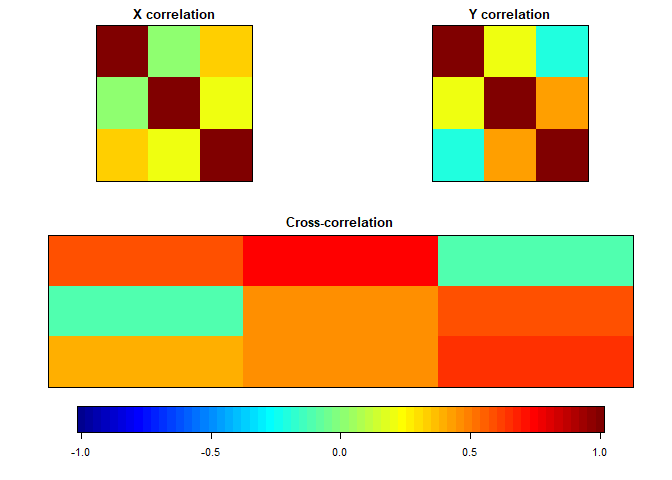

HW \#7: Multiple Dependent Variables
================
Daniel Lewis
2/12/20

## Set up working environment

As usual, I need to load the R packages I will be using.

``` r
# R Markdown
library(knitr)

# Project
library(here)

# Statistics
library(CCA)
library(psych)

# Tidyverse
library(readxl)
library(broom)
library(tidyverse)
```

# 1\. Reproducing the Thompson example

## Importing the data

First, I will read in the Thompson data. I will also glance at the data
to see what I’m working with.

``` r
tbl.1 <- read_excel(here('data', 'THOMPSON.xlsx'))

tbl.1[1:10, ] %>%
  kable
```

| CHA6 | INT6 | OTH6 | CHA2 | INT2 | OTH2 |  IQ | IQGRP | EXPERGRP | CIQGRP1 | CIQGRP2 | CEXGRP1 | CIQBYEX1 | CIQBYEX2 |
| ---: | ---: | ---: | ---: | ---: | ---: | --: | ----: | -------: | ------: | ------: | ------: | -------: | -------: |
|   20 |   17 |   19 |    7 |    7 |    7 |  68 |     1 |        1 |     \-1 |     \-1 |       1 |      \-1 |      \-1 |
|   21 |   20 |   15 |    8 |    7 |    5 |  89 |     1 |        1 |     \-1 |     \-1 |       1 |      \-1 |      \-1 |
|   17 |   15 |   20 |    7 |    6 |    7 |  50 |     1 |        2 |     \-1 |     \-1 |     \-1 |        1 |        1 |
|   16 |   14 |   13 |    8 |    5 |    5 |  85 |     1 |        2 |     \-1 |     \-1 |     \-1 |        1 |        1 |
|   20 |   20 |   15 |    8 |    7 |    5 |  90 |     2 |        1 |       0 |       2 |       1 |        0 |        2 |
|   14 |   21 |   15 |    7 |    5 |    7 | 109 |     2 |        1 |       0 |       2 |       1 |        0 |        2 |
|   14 |   19 |   14 |    7 |    5 |    6 | 102 |     2 |        2 |       0 |       2 |     \-1 |        0 |      \-2 |
|   14 |   23 |   10 |    6 |    6 |    6 | 108 |     2 |        2 |       0 |       2 |     \-1 |        0 |      \-2 |
|   21 |   14 |   12 |    8 |    5 |    2 | 111 |     3 |        1 |       1 |     \-1 |       1 |        1 |      \-1 |
|   19 |   12 |   10 |    7 |    6 |    4 | 140 |     3 |        1 |       1 |     \-1 |       1 |        1 |      \-1 |

``` r
describe(tbl.1)[c('n', 'mean', 'sd', 'min', 'max')] %>%
  kable
```

|          |  n |       mean |         sd | min | max |
| -------- | -: | ---------: | ---------: | --: | --: |
| CHA6     | 12 |  18.166667 |  3.2427074 |  14 |  24 |
| INT6     | 12 |  18.083333 |  3.7769236 |  12 |  24 |
| OTH6     | 12 |  14.250000 |  3.6958207 |   9 |  20 |
| CHA2     | 12 |   7.250000 |  0.7537784 |   6 |   8 |
| INT2     | 12 |   6.083333 |  0.9962049 |   5 |   8 |
| OTH2     | 12 |   5.583333 |  1.6213537 |   2 |   8 |
| IQ       | 12 | 101.250000 | 27.0861420 |  50 | 143 |
| IQGRP    | 12 |   2.000000 |  0.8528029 |   1 |   3 |
| EXPERGRP | 12 |   1.500000 |  0.5222330 |   1 |   2 |
| CIQGRP1  | 12 |   0.000000 |  0.8528029 | \-1 |   1 |
| CIQGRP2  | 12 |   0.000000 |  1.4770979 | \-1 |   2 |
| CEXGRP1  | 12 |   0.000000 |  1.0444659 | \-1 |   1 |
| CIQBYEX1 | 12 |   0.000000 |  0.8528029 | \-1 |   1 |
| CIQBYEX2 | 12 |   0.000000 |  1.4770979 | \-2 |   2 |

Aside from the ridiculously low
, and one person with a
low enough IQ that it could impair functioning during data collection,
the data look alright.

## Preliminary steps

Now, I will attempt to reproduce the canonical correlation analysis
(CCA) presented by Thompson ([1991](#ref-thompson1991m&eic&d)).
Unfortunately, I found Thompson’s explanation practically
indecipherable, and Sherry & Henson ([2005](#ref-sherry2005jpa)) provide
only the SPSS syntax without explanation, so I fell back on using the R
package `CCA` to automate the process (Gonzalez et al.,
[2008](#ref-gonzalez2008jss)).

`CCA` first requires that dataframe subsets be transformed into
matrices.

``` r
mtx.1.X <- as.matrix(tbl.1[1:3])
mtx.1.Y <- as.matrix(tbl.1[4:6])
```

Then, I need to verify that zero-order correlations are sufficiently
high to warrant continue with CCA.

``` r
lst.1.cor <- matcor(mtx.1.X, mtx.1.Y)
lst.1.cor
```

    ## $Xcor
    ##             CHA6        INT6      OTH6
    ## CHA6 1.000000000 0.006185575 0.3223870
    ## INT6 0.006185575 1.000000000 0.1937516
    ## OTH6 0.322387044 0.193751553 1.0000000
    ## 
    ## $Ycor
    ##           CHA2      INT2       OTH2
    ## CHA2  1.000000 0.2118620 -0.2045590
    ## INT2  0.211862 1.0000000  0.4174357
    ## OTH2 -0.204559 0.4174357  1.0000000
    ## 
    ## $XYcor
    ##              CHA6         INT6      OTH6       CHA2      INT2       OTH2
    ## CHA6  1.000000000  0.006185575 0.3223870  0.5764844 0.7269948 -0.1239193
    ## INT6  0.006185575  1.000000000 0.1937516 -0.1037788 0.4570514  0.5851554
    ## OTH6  0.322387044  0.193751553 1.0000000  0.3997503 0.4629659  0.6561525
    ## CHA2  0.576484426 -0.103778841 0.3997503  1.0000000 0.2118620 -0.2045590
    ## INT2  0.726994814  0.457051406 0.4629659  0.2118620 1.0000000  0.4174357
    ## OTH2 -0.123919308  0.585155435 0.6561525 -0.2045590 0.4174357  1.0000000

``` r
img.matcor(lst.1.cor, type = 2)
```

<!-- -->

While a few correlations are very low (e.g., CHA6 with INT6), most of
the correlations are substantial. I think we have more than enough to
work with.

## Canonical correlation analysis

Finally, I can compute the canonical correlations.

``` r
lst.1.cca <- cc(mtx.1.X, mtx.1.Y)
```

Results in hand, I will try to match the tables to the results presented
in Thompson ([1991](#ref-thompson1991m&eic&d)).

The first columns (corresponding to Function I) of `xscores` and
`yscores` approximate the results in Table 2 from Thompson
([1991](#ref-thompson1991m&eic&d)) under CRIT1 and PRED1 respectively.

``` r
tibble(lst.1.cca$scores[["xscores"]][,1],
       lst.1.cca$scores[["yscores"]][,1]) %>%
  kable(col.names = c("xscores", "yscores"), digits = 5)
```

|   xscores |   yscores |
| --------: | --------: |
|   0.81894 |   0.70811 |
|   0.85361 |   1.02946 |
|   0.12245 | \-0.01459 |
| \-0.97733 | \-0.41594 |
|   0.64646 |   1.02946 |
| \-0.50190 | \-0.73729 |
| \-0.80497 | \-0.87472 |
| \-0.88291 | \-0.74821 |
| \-0.05561 | \-0.82821 |
| \-0.88699 | \-0.42686 |
|   2.30922 |   2.16443 |
| \-0.64098 | \-0.88563 |

Next, the results for `corr.X.xscores` and `corr.Y.yscores` approximate
the results of the columns labeled “Str.” in Table 3. I have pulled out
the results for Function I as an example, but I checked the Function II
and Function III results for completeness.

``` r
tibble(c("CHA", "INT", "OTH"),
       lst.1.cca$scores[["corr.X.xscores"]][,1],
       lst.1.cca$scores[["corr.Y.yscores"]][,1]) %>%
  kable(col.names = c("Variable", "Str. (X &#xFF5C; 6)", "Str. (Y &#xFF5C; 2)"), digits = 4)
```

| Variable | Str. (X ｜ 6) | Str. (Y ｜ 2) |
| :------- | -----------: | -----------: |
| CHA      |       0.8098 |       0.5564 |
| INT      |       0.4428 |       0.9082 |
| OTH      |       0.7071 |       0.4314 |

At first I was worried because the canonical correlations do *not* seem
to match. But then I realized that `CCA` produced unmodified
correlations while Thompson ([1991](#ref-thompson1991m&eic&d)) presented
only squared correlations.

``` r
tibble(Function = c("I", "II", "III"),
       Rc = lst.1.cca$cor,
       Rc2 = lst.1.cca$cor^2) %>%
  kable(digits = 4)
```

| Function |     Rc |    Rc2 |
| :------- | -----: | -----: |
| I        | 0.9322 | 0.8690 |
| II       | 0.9082 | 0.8249 |
| III      | 0.4026 | 0.1621 |

To substantively interpret the final results, we can say that the data
from first scale explains about 87% of the variance in the data from the
second scale.

# 2\. Multivariate Multiple Regression Analysis

As before, I will begin by importing and viewing the data.

``` r
tbl.2 <- read_excel(here('data', 'TAHEALTH.xlsx'))

tbl.2[1:10, ] %>%
  kable
```

|   ANX |   DEP |   SOM |      ANG |    BORSI |    BORHC |    FRATP |    FRAHC |
| ----: | ----: | ----: | -------: | -------: | -------: | -------: | -------: |
| 1.000 | 1.500 | 1.125 | 1.000000 | 2.755731 | 3.538168 | 2.911637 | 3.347454 |
| 2.000 | 1.875 | 1.125 | 1.000000 | 3.173576 | 4.676048 | 4.183934 | 4.227192 |
| 2.125 | 1.750 | 1.625 | 1.000000 | 3.744117 | 4.259478 | 4.545141 | 3.902141 |
| 1.375 | 1.750 | 1.250 | 1.000000 | 3.310074 | 4.149797 | 3.895149 | 3.979698 |
| 1.625 | 1.500 | 1.375 | 1.000000 | 4.086066 | 4.346248 | 4.545141 | 4.486582 |
| 1.875 | 2.000 | 1.375 | 1.000000 | 3.745104 | 3.930142 | 4.545141 | 4.027462 |
| 1.500 | 1.375 | 1.375 | 1.428571 | 2.879338 | 4.024731 | 3.707935 | 4.156733 |
| 1.500 | 1.875 | 1.375 | 1.000000 | 3.277082 | 4.103431 | 3.895149 | 3.850426 |
| 3.000 | 2.500 | 2.250 | 1.000000 | 3.793251 | 4.259266 | 4.545141 | 4.156733 |
| 1.375 | 1.750 | 1.125 | 1.000000 | 3.227344 | 3.766024 | 3.895149 | 4.227192 |

``` r
describe(tbl.2)[c('n', 'mean', 'sd', 'min', 'max')] %>%
  kable
```

|       |   n |     mean |        sd |      min |      max |
| ----- | --: | -------: | --------: | -------: | -------: |
| ANX   | 211 | 1.652251 | 0.3380586 | 1.000000 | 3.000000 |
| DEP   | 211 | 1.723934 | 0.3160895 | 1.000000 | 2.875000 |
| SOM   | 211 | 1.545320 | 0.3105911 | 1.000000 | 3.250000 |
| ANG   | 211 | 1.072444 | 0.1639939 | 1.000000 | 2.142857 |
| BORSI | 211 | 3.401333 | 0.4820000 | 1.746387 | 4.366041 |
| BORHC | 211 | 3.865833 | 0.4733333 | 2.359166 | 4.676048 |
| FRATP | 211 | 3.950000 | 0.4750000 | 2.911637 | 4.545141 |
| FRAHC | 211 | 3.930000 | 0.2850000 | 2.975834 | 4.486582 |

Next, I will compute a multivariate multiple regression (MMR) analysis,
as described in Dwyer ([1983](#ref-dwyer1983smftsabs)).

``` r
fit.2 <- lm(cbind(ANX, DEP, SOM, ANG) ~ BORSI + BORHC + FRATP + FRAHC, tbl.2)
tidy(fit.2) %>%
  kable
```

| response | term        |    estimate | std.error |   statistic |   p.value |
| :------- | :---------- | ----------: | --------: | ----------: | --------: |
| ANX      | (Intercept) |   0.5868657 | 0.3198641 |   1.8347343 | 0.0679872 |
| ANX      | BORSI       |   0.1888392 | 0.0518984 |   3.6386318 | 0.0003465 |
| ANX      | BORHC       | \-0.1259394 | 0.0627035 | \-2.0084914 | 0.0458968 |
| ANX      | FRATP       |   0.2070872 | 0.0500461 |   4.1379271 | 0.0000511 |
| ANX      | FRAHC       |   0.0233961 | 0.1037177 |   0.2255750 | 0.8217556 |
| DEP      | (Intercept) |   1.4286823 | 0.3183598 |   4.4876342 | 0.0000120 |
| DEP      | BORSI       |   0.1418660 | 0.0516543 |   2.7464486 | 0.0065578 |
| DEP      | BORHC       | \-0.0788673 | 0.0624086 | \-1.2637243 | 0.2077572 |
| DEP      | FRATP       |   0.1036491 | 0.0498108 |   2.0808588 | 0.0386832 |
| DEP      | FRAHC       | \-0.0742515 | 0.1032299 | \-0.7192832 | 0.4727816 |
| SOM      | (Intercept) |   1.0724915 | 0.3134619 |   3.4214409 | 0.0007511 |
| SOM      | BORSI       |   0.1463901 | 0.0508596 |   2.8783157 | 0.0044196 |
| SOM      | BORHC       | \-0.1538801 | 0.0614485 | \-2.5042149 | 0.0130480 |
| SOM      | FRATP       |   0.0613301 | 0.0490444 |   1.2505003 | 0.2125354 |
| SOM      | FRAHC       |   0.0833405 | 0.1016417 |   0.8199432 | 0.4131962 |
| ANG      | (Intercept) |   0.8566223 | 0.1680347 |   5.0978897 | 0.0000008 |
| ANG      | BORSI       |   0.0192166 | 0.0272639 |   0.7048378 | 0.4817073 |
| ANG      | BORHC       | \-0.0769388 | 0.0329401 | \-2.3357170 | 0.0204677 |
| ANG      | FRATP       |   0.0596216 | 0.0262908 |   2.2677759 | 0.0243803 |
| ANG      | FRAHC       |   0.0540424 | 0.0544862 |   0.9918561 | 0.3224313 |

If we interpret the general hypothesis that “the components of Type-A
behavior are detrimental to health” as meaning that at least one
 (excepting
) is
significantly different from zero, the hypothesis is clearly supported.
Only FRAHC does not significantly predict any health outcome
(controlling for other predictors; ). This interpretation is equivalent to Hypothesis 1
described by Dwyer ([1983](#ref-dwyer1983smftsabs)).

Alternatively, we might hypothesize that all four independent variables
together predict each of the four health outcomes. To consider that
hypothesis, I will pull together the
 values for the
four models.

``` r
fit.2 %>%
  summary %>%
  map_dbl("r.squared") %>%
  enframe %>%
  rename(outcome = "name", R2 = "value") %>%
  mutate(outcome = str_trunc(outcome, 3, "left", ellipsis = "")) %>%
  kable(digits = 3)
```

| outcome |    R2 |
| :------ | ----: |
| ANX     | 0.190 |
| DEP     | 0.082 |
| SOM     | 0.078 |
| ANG     | 0.050 |

The Type-A characteristics best predict anxiety, but even that has an
 of only about
0.19, meaning that the Type-A predictors explain about 19% of the
variance in anxiety in the sample. The other models have even poorer
fit. However, all four models significantly fit the data.

A third hypothesis could be that each independent variable predicts all
four health outcomes. To test this hypothesis, I will compute a MANOVA.

``` r
manova(cbind(ANX, DEP, SOM, ANG) ~ BORSI + BORHC + FRATP + FRAHC, tbl.2) %>%
  tidy %>%
  kable
```

| term      |  df |    pillai | statistic | num.df | den.df |   p.value |
| :-------- | --: | --------: | --------: | -----: | -----: | --------: |
| BORSI     |   1 | 0.1215086 | 7.0194876 |      4 |    203 | 0.0000260 |
| BORHC     |   1 | 0.0324961 | 1.7045695 |      4 |    203 | 0.1503327 |
| FRATP     |   1 | 0.1028895 | 5.8205135 |      4 |    203 | 0.0001872 |
| FRAHC     |   1 | 0.0150791 | 0.7769804 |      4 |    203 | 0.5413133 |
| Residuals | 206 |        NA |        NA |     NA |     NA |        NA |

R uses Pillai’s trace and its corresponding F-statistic as the test
statistic for each independent variable. The results suggest that BORSI
and FRATP significantly predict health outcomes, while BORHC and FRAHC
do not.

# 3\. Canonical Correlation Analysis

In order to calculate Wilks’ lambda and Bartlett’s Chi-Square as an
omnibus test, I need the four canonical correlations.

``` r
mtx.2.X <- as.matrix(tbl.2[5:8])
mtx.2.Y <- as.matrix(tbl.2[1:4])
lst.2 <- cc(mtx.2.X, mtx.2.Y)$cor^2

tibble(Function = c("I", "II", "III", "IV"),
       Rc2 = lst.2) %>%
  kable(digits = 4)
```

| Function |    Rc2 |
| :------- | -----: |
| I        | 0.1990 |
| II       | 0.0259 |
| III      | 0.0174 |
| IV       | 0.0091 |

## a. Wilks’ lambda

I will write a function to calculate Wilks’ lambda
() and compute
 for the first canonical
correlation.

``` r
# This function takes a vector of canonical correlations and computes Wilks' lambda
fun.2.a <- function(ccs) {
  ccs %>%
    map_dbl(~ 1 - .) %>%
    prod
}

fun.2.a(lst.2)
```

    ## [1] 0.7597165

## b. Bartlett’s Chi-Square

I will write a second function that uses
 to calculate a
-statistic and compute

for the first canonical correlation.

``` r
# This function takes the sample size (N), number of IVs (p), the number of DVs (q),
# and Wilks' lambda and computes Bartlett's Chi-Square (and a p-value)
fun.2.b <- function(N, p, q, W) {
  c <- -(N - 1 - .5 * (p + q + 1)) * log(W)
  c(chi.sq = c,
    p.val = pchisq(c, p*q, lower.tail = F))
}

fun.2.b(211, 4, 4, fun.2.a(lst.2))
```

    ##       chi.sq        p.val 
    ## 5.647343e+01 2.032111e-06

Clearly, that is significant, so I will proceed to test the remaining
canonical correlations.

``` r
# This function takes a vector of canonical correlations and the sample size and returns
# all significant correlations, plus one
fun.2 <- function(ccs, N) {
  prob <- 0.0
  res <- tibble(ord = integer(), Rc2 = numeric(), W = numeric(),
                chi.sq = numeric(), p.val = numeric(), .rows = 0)
  while (prob < .05 && length(ccs) > 0) {
    w <- fun.2.a(ccs)
    c <- fun.2.b(N, length(ccs), length(ccs), w)
    prob <- c[[2]]
    res <- add_row(res, ord = 5 - length(ccs), Rc2 = ccs[[1]],
                   W = w, chi.sq = c[[1]], p.val = prob)
    ccs <- ccs[-1]
  }
  res
}

fun.2(lst.2, 211) %>%
  kable
```

| ord |       Rc2 |         W |   chi.sq |     p.val |
| --: | --------: | --------: | -------: | --------: |
|   1 | 0.1990122 | 0.7597165 | 56.47343 | 0.0000020 |
|   2 | 0.0259032 | 0.9484746 | 10.92392 | 0.2809602 |

It appears that only the first canonical correlation is significant
(). Therefore, we can reject the null
hypothesis and conclude that there is a relationship between Type-A
characteristics and health outcomes as represented by the full model.
However, because the second canonical correlation was not significant,
we cannot say anything about the subsets of the variable sets.

At least, not according to the procedure described in the syllabus and
in Thompson ([1991](#ref-thompson1991m&eic&d)). Sherry & Henson
([2005](#ref-sherry2005jpa)), by contrast, propose exploring all
possible subsets of the variables. They write

> There will be as many functions (i.e., variates) as there are
> variables in the smaller set, which in this case is four (the
> predictor set). Each function must be evaluated because some of them
> may not explain enough of the relationship between the variable sets
> to warrant interpretation.
> 
> — Sherry & Henson ([2005](#ref-sherry2005jpa), p. 42)

I do not quite see what the use would be in testing the third and fourth
canonical correlations, which have even less variance to work with, when
the second correlation was not significant. But perhaps it would bring
into question the value of the additional predictors.

# 4\. Comparison of MMR and CCA

MMR offers more information about the unique effects of each predictor
on the set of outcomes and on each outcome individually. It does allow
for some correction to avoid “experimentwise” Type I error. However, it
does not allow for a single test of the full model including the
relationships between all independent and dependent variables.

CCA provides a simple test of the full model, as well as allowing for
analysis of any residual variance that can be explained by a subset of
the full model. However, obtaining the unique effects of each predictor
requires additional calculations and would be easier found through MMR.

# References

<div id="refs" class="references">

<div id="ref-dwyer1983smftsabs">

Dwyer, J. H. (1983). Multivariate Regression and Multivariate ANOVA. In
*Statistical models for the social and behavioral sciences* (pp.
163–207). Oxford University Press.

</div>

<div id="ref-gonzalez2008jss">

Gonzalez, I., Déjean, S., Martin, P., & Baccini, A. (2008). CCA : An R
Package to Extend Canonical Correlation Analysis. *Journal of
Statistical Software*, *23*(12). <https://doi.org/10.18637/jss.v023.i12>

</div>

<div id="ref-sherry2005jpa">

Sherry, A., & Henson, R. K. (2005). Conducting and Interpreting
Canonical Correlation Analysis in Personality Research: A User-Friendly
Primer. *Journal of Personality Assessment*, *84*(1), 37–48.
<https://doi.org/10.1207/s15327752jpa8401_09>

</div>

<div id="ref-thompson1991m&amp;eic&amp;d">

Thompson, B. (1991). A primer on the logic and use of canonical
correlation analysis. *Measurement & Evaluation in Counseling &
Development*, *24*(2), 80.

</div>

</div>
